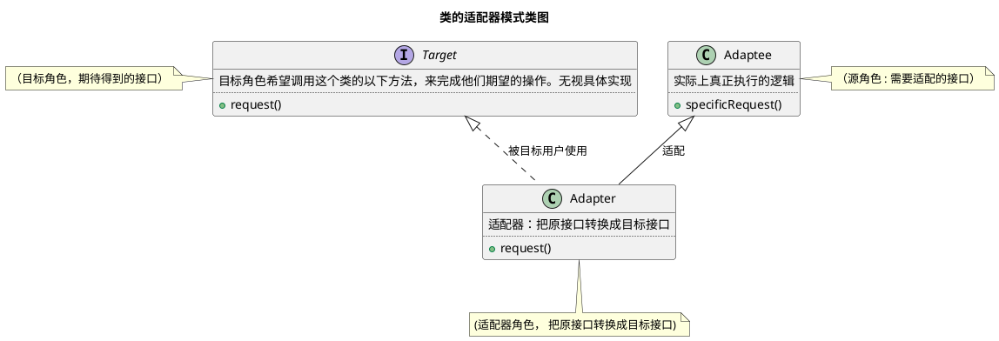
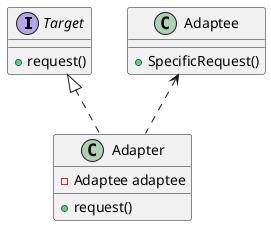

# 适配器模式
##### 主要作用
解决接口之间的不兼容问题，用于包装不兼容的对象，使原本由于接口不兼容而不能在一起工作的哪些类可以在一起工作。
##### 分类

- 类的适配器模式
- 对象的适配器模式
#### 类的适配器模式
类的适配器模式是把适配的类的API转换成为目标类的API

#### 对象的适配器模式
对象的适配器模式，本质上也是一样的道理，但是不同的是，对象的适配器模式不是使用的继承关系链接到Adaptee类，而是使用委派关系连接到Adaptee类的。

##### uml

