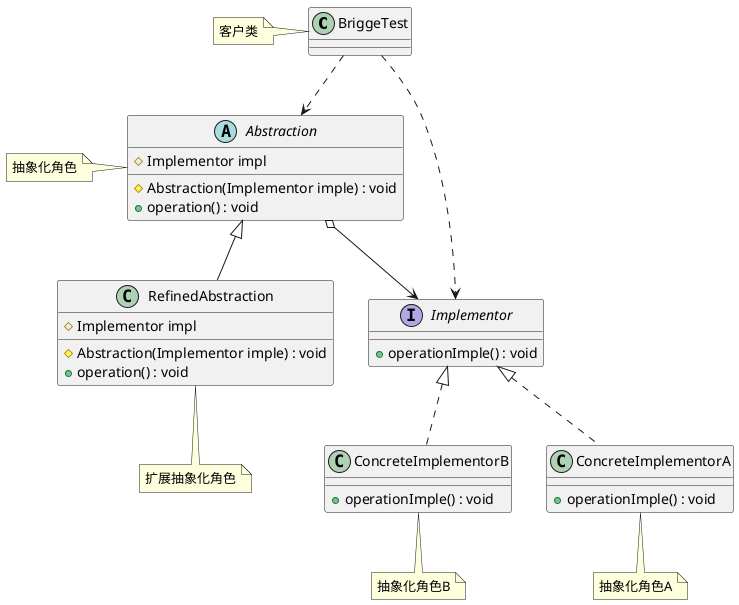

#桥接模式

##### 定义
将抽象与实现进行分离，使他们每一个都可以独立变化。它是用组合关系来代替集成关系来实现，从而降低抽象和实现这两个维度的耦合度。
桥接模式遵循了历史替换原则，和依赖倒置原则，最终实现了开闭原则，对修改关闭，对扩展开放。（是人话么。。。）。
##### 解决的是什么问题
##### 优缺点
- 优点
  - 抽象与实现进行分离，扩展能力强
  - 符合开闭原则（什么是开闭原则）
  - 符合合成复用原则（什么是合成复用原则）
  - 实现细节对客户透明（透明的意思是，用户一看就知道呢，还是，用户啥也看不见，啥都不知道呢？垃圾的专业术语真讨厌）
- 缺点
  - 由于聚合关系是建立在抽象层的，要求开发者针对抽象化进行设计与编程，能正确的识别出系统中两个独立变化的维护，这增加了对系统的理解，以及设计的难度。

