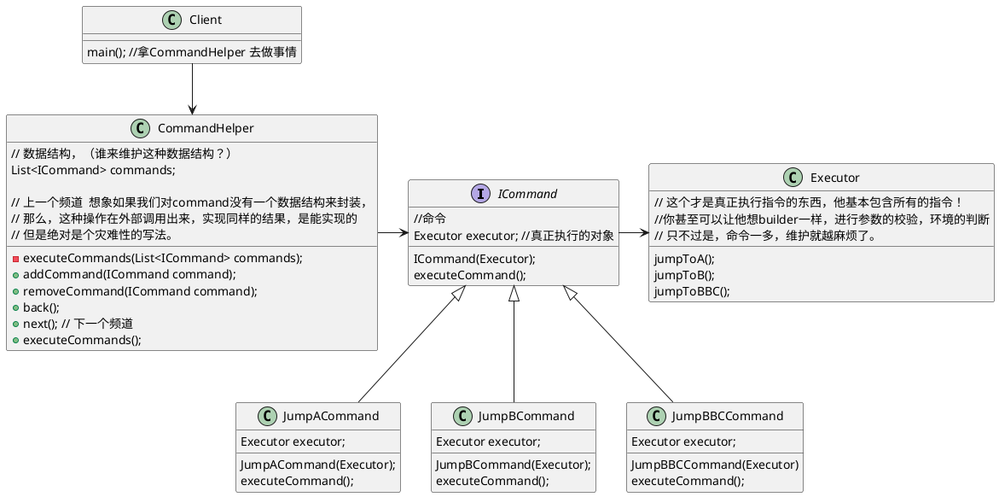

# Command Pattern
命令模式
我觉得我并没有找到很好的博客能够了解这个模式的本质

简单来讲，命令模式，就是将命令与操作进行结合，并进行封装，最后形成一个对象一个对象这类的形式。以便于真实运行的时候，可以将这些命令以数据结构的形式进行存储，从而形成对命令的增删查改这类功能。
其实在本质上，执行不同命令的角色，很可能是同一个对象，只不过是对这个执行对象进行了一个封装而已，其目的就是让这些命令具有可编辑性。

#### 是碰到了什么问题，才出现的它
我认为这家伙顶多就能解决一些极其枯燥，很单元的，一些执行。至少现在我是这么认为的。
比如，现在的饭店点餐。用户形成最后的订单之前，往往需要点很多菜，这些菜就是一条条命令，哪个菜不要辣，哪个菜不放糖，牛排要五分熟？等等，每个命令可以是一个对象，如果用户在下单前后悔了，说不要牛排了。这样也可以很简单的把牛排那个命令给删除掉。编辑的最终结果是产生一个命令的集合--订单！
#### 它是什么(粗略的)

本质就是，把操作转成特定的对象，以便于之后的增删查改。这是我个人总结出来的。和网上理解的不一样，我私认为我理解的是比较透彻的。
其实我之前代码里用到过这样的模式。(而不自知啊),后来因为可读性实在太差，不得不改了方案。可读性也是代码的一个很重要的标准。别人看不懂，只能说明我实现的不好。

#### 这个东西的具体是什么(详细的)
将命令与操作结合，以便于形成数据结构，进行增删查改。

这一句话拆开，具体就可以知道这个模式需要怎样的角色，怎样的处理。
解析：

**命令**
**操作**
**数据结构，（谁来维护这种数据结构？）**
**谁形成的数据结构**

以遥控操作电视机为例子

**，代码详细请见项目CommandPattern文件夹**
#### 它是用来解决什么问题的，什么类的(目的)

#### 这个东西的优势是什么（用处）

#### 如果这个东西用的不好，会出现什么问题(用错了，理解错了会怎样)

#### 总结精髓