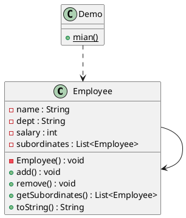

# 组合模式
组合模式，又叫部分整体模式，是用于把一组相似的对象，当做单一的对象。组合模式依据树形结构来组合对象，用来表示部分以及整体层次。这种类型的设计模式属于结构型模式，它提供了修改相同对象组的方式。
#### 介绍
**意图**: 将对象组合成树形结构以表示”部分-整体“的层次结构。组合模式使得用户对单个对象和组合对象的使用具有一致性。
**主要解决**: 它在我么的属性结构的问题中，模糊了简单元素和复杂元素的概念，客户程序可以像处理简单元素一样处理复杂元素，从而使得客户程序的复杂元素的内部结构解耦。
**应用实例**: 
- s算术表达式包括操作数，操作符和另一个操作数，其中，另一个操作符也可以是操作数，操作符和另一个操作数。
- 在java AWT 和 SWING中对于Button 和 CheckBox是树叶， Container是树枝。Android View源码可以参考下。
**何时使用**: 
- 您想表示对象的部分-整体层次结构的时候（树形结构）
- 您希望用户忽略组合对象与单个对象的不同，用户将统一的使用组合结构中的所有对象。
- 
**优点**
1 高层模块调用简单。
2 节点自由增加
**缺点**
在使用组合模式的时候，其叶子和树枝的声明都是直线类，而不能是接口，违反了依赖倒置原则。(不明白依赖倒置原则，去请参考另外一篇文章，讲不透算我输！)
**使用场景** 部分，整体场景，如树形菜单，文件，文件夹的管理
**注意事项**： 定义时为具体类

#### 实现
