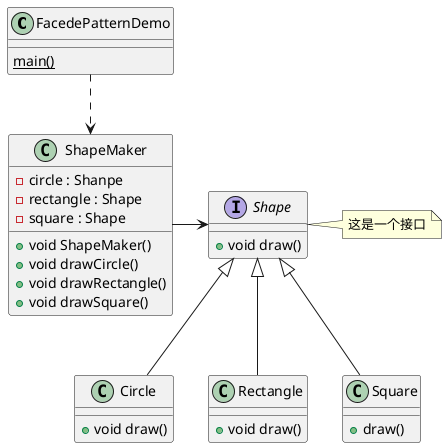

# Facade Pattern
##### 外观模式简介
外观模式用以隐藏系统的复杂性，并向客户端提供一个可以访问的系统接口。这种接口属于结构型模式，它向现有的系统添加一个接口，来隐藏系统的复杂性。
这种模式涉及到一个单一的类，该类提供了客户端请求的简单方法对现有类的方法委托调用。
##### 介绍
**意图**: 为子系统中的一组接口提供一个一致的界面，外观模式定义了一个高层接口，这个接口使得这一子系统更加容易使用。
**主要解决**: 降低访问复杂系统的内部子系统时的复杂度，简化客户端与之的接口。
**何时使用**: 
1 客户端不需要知道系统内部的复杂联系，整个系统只需要提供一个接待员即可。
2 定义系统的接口（我感觉像我这种写需求的，应该实战中用到的不多）
**如何解决**: 客户端不与系统耦合，外观类与系统耦合
**关键代码**: 在客户端和复杂系统之间再加一层，这一层将调用顺序，依赖关系等处理好。
**应用实例**: 
1 去医院看病，可能要去挂号，门诊，划价，取药，让患者或者患者家属觉得很复杂，如果有提供接待人员，只让接待人员来处理，就很方便。
2 JAVA的三层开发模式
**优点**:
1 减少系统的相互依赖
2 提高灵活性
3 提高安全性
**缺点**: 不符合开闭原则，如果要改东西会很麻烦，继承重写都不合适(代码如何体现)
**使用场景**: 
1 为复杂的模块或者子系统提供外界访问的模块
2 子系统相对独立
3 预防低水平人员发带来的风险
**注意事项**: 在层次化结构中，可以使用外观模式定义系统的每一层接口。（那么问题来了，当系统层数过多的时候，比如有10层， 需要不断的加接口的情况下， 会很恶心。我感觉我们的适配层就有些倾向于这种，加一个接口，要顺带加很多东西，恶心至极。或许是他们用错方式了。）

##### 实现

我认为最关键的是 ShapeMaker 接口的定义，这个应该就是外观模式的核心。反而Shape的接口以及实现是可以变更的，应该不是特别重要的东西。
也就是，这个非常重要的是，接口是写给客户程序员的，无论你自身的实现是多么复杂，但是给他们提供出去的接口，要简单清晰明了，容易理解。最好调用也不要那么复杂
这样对开发人员有一个很高的要求就是：必须分得清，你的接口的粒度，是要给的粗一些还是要细一些。我认为我们的适配层代码的login，给的粒度就太粗，导致login这个流程涵盖了好多原本就不属于login的逻辑。就是明明不该在login的流程中，却写在了这个login的接口中。如果客户程序员需要更高的要求，人家没有权限修改你的代码，。另外是，你大概率不得不为了符合人家的需求而改代码，最后发现根本就拆不出来了。耦合很严重！

代码实现详见工程。