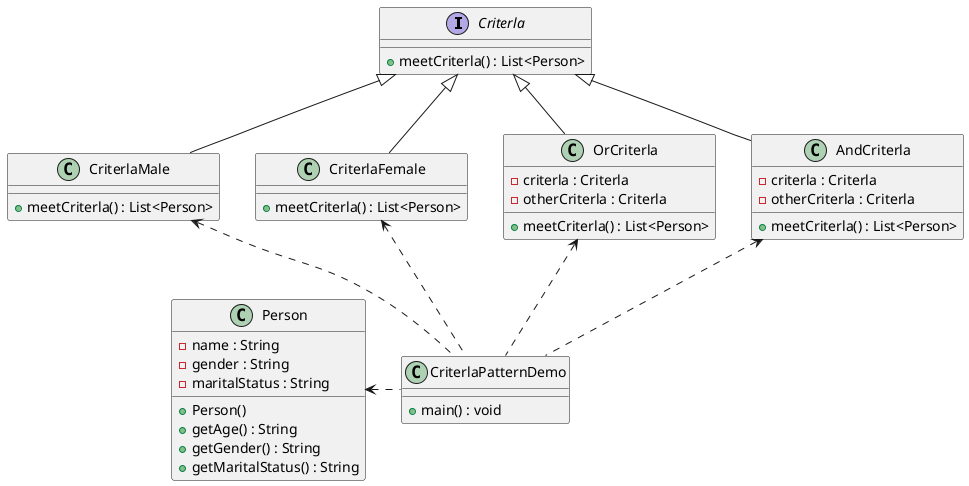

# Filter Pattern
##### 简介
过滤器模式或者标准模式是一种设计模式，允许开发人员使用不同的标准来过滤一组对象，通过逻辑运算以解耦的方式将他们连接起来，这种设计模式数据结构性设计模式。他会结合多个标准来获得单一标准
##### 类图简介

```puml
@startuml

together {
    interface Criterla {
        + meetCriterla() : List<Person>
    }

    class AndCriterla {
        - criterla : Criterla
        - otherCriterla : Criterla
        + meetCriterla() : List<Person>
    }

    class OrCriterla {
        - criterla : Criterla
        - otherCriterla : Criterla
        + meetCriterla() : List<Person>
    }

    class CriterlaFemale {
        + meetCriterla() : List<Person>
    }

    class CriterlaMale {
        +meetCriterla() : List<Person>
    }
}


Criterla <|-down- AndCriterla
Criterla <|-down- OrCriterla
Criterla <|-down- CriterlaFemale
Criterla <|-down- CriterlaMale

class Person{
    - name : String
    - gender : String
    - maritalStatus : String
    + Person()
    + getAge() : String
    + getGender() : String
    + getMaritalStatus() : String
}

class CriterlaPatternDemo{
    + main() : void
}

CriterlaPatternDemo .left.> Person
CriterlaPatternDemo .up.> AndCriterla
CriterlaPatternDemo .up.> OrCriterla
CriterlaPatternDemo .up.> CriterlaFemale
CriterlaPatternDemo .up.> CriterlaMale
@enduml
```