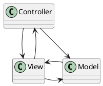

# MVC Pattern
这个模式，与其说是模式，不如说是框架哈。这个在我看来实则没啥必要学。额。正是因为这套东西饱为诟病，Android才发展了后来的MVP模式和MVVM模式的。

MVC会导致Activity中的逻辑耦合大，并且异常的庞大。不利于维护。

```puml
@startuml
class Model{

}

class Controller{

}

class View{

}

Controller -down-> Model
Controller -down-> View
View -right-> Model
Model -left-> View
View -up-> Controller
@enduml 
```

想了解MVC模式的话，请阅读刚毕业时那个工程的垃圾代码。你懂得！