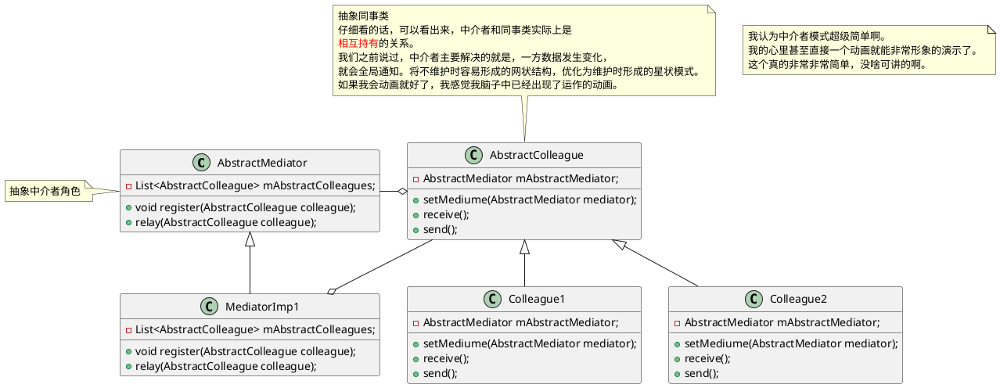

# Mediator Pattern

中介者模式，又称调停模式
了解这个之前建议了解一下迪米特法则，中介者模式就是迪米特法则的典型应用。我觉的这个法则更有学习价值！

#### 是碰到了什么问题，才出现的它

举个简单的例子，假设写程序时候，需要维护一个数据，假设类， A, B, C，D，E 都会用到这个数据，并且都会修改这个数据。并且每一方修改数据的时候，其余的各类必须也修改这个数据并呈现不同的效果。
那么最完蛋的一种写法就是，让ABCDE这几个类全部相互持有，每当任意一个修改数据的时候，就调用这几个类也去修改数据。这样效果算是完成了。但是这种实现方式就一言难尽啊。想象假设增加了一个新的类D也是同样类似的作用，你起码得把前面的五个类都要改掉啊，晓不晓得得影响到多少逻辑。这种牵一发动全身的实现方式着实不推荐。
那么为了优化，我们第一个想到的就是，让上述一团乱麻的网状关系变一下，给一个中间总控的概念，由网状变成星状。每一个类触发数据变化的时候，只与这个中间总控进行交互，剩下的就别管了。剩下通知其他类这个数据发生变化，这个任务就让这个总控制去通知得了。

#### 它是什么(粗略的)

简单点就是，将一些八竿子打不着关系的类彻底隔离，如果有一些小小的交互需要联系彼此，那么请不要让这些类直接相互持有，要搞一个中间类去联系他们。这种模式非常像Android中常用的MVP模式。看看类图就能明白，是很相似（但是不同）的。理念差不多。
#### 这个东西的具体是什么(详细的)

#### 它是用来解决什么问题的，什么类的(目的)

这个模式在我看来，是在处理一类横跨各类纵向模块的，一种横向的控制逻辑。数据控制也好，业务控制也好，重点是，它是横向的！横向就意味着我们可能持有很多纵向的东西。去操控他们。

#### 这个东西的优势是什么（用处）

#### 如果这个东西用的不好，会出现什么问题(用错了，理解错了会怎样)

#### 总结

