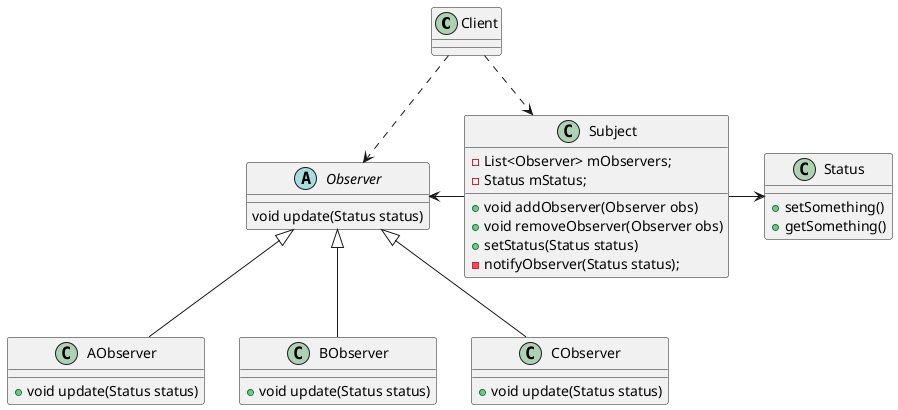

# 观察者模式

#### 它有什么历史
没什么历史。

#### 是碰到了什么问题，才出现的它

#### 它是什么(粗略的)

#### 这个东西的具体是什么(详细的)

uml图的样式

我认为这个图有一点问题，就是，绑定器，是不是应该全局保持一个， 还是全局保持多个？

#### 它是用来解决什么问题的，什么类的(目的)

#### 这个东西的优势是什么（用处）

#### 如果这个东西用的不好，会出现什么问题(用错了，理解错了会怎样)

#### 总结精髓