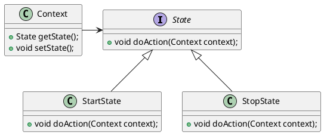

# State Pattern （状态模式）
在状态模式中，类的行为是基于他的状态改变的。这种类型的设计模式属于行为型模式。
在状态模式中，我们创建表示各种状态的对象，和一个行为随着状态对象改变而改变的context对象。
??? context不是上下文吗？怎么还有行为？
##### 介绍

#### UML

#### 简介


```java
public interface State{
    public void doAction(Context context);
}
```

```java
public class StartState implements State{
    public void doAction(Context context) {
        Systerm.out.println("Player is start state");
        context.setState(this);  //此处是错误的
    }

    public String toString() {
        return "Starte State";
    }
}
```

```java
public class StopState implements State{
    public void doAction(Context context) {
        Systerm.out.println("Player is stop");
        context.setState(this);
    }

    puclic String toString() {
        return "Stop State";
    }
}
```

```java
public class Context{
    private State state;
    public Context(){
        state = null;
    }

    public void setState(State state) {
        this.state = state;
    }

    // 我认为这个方法没有什么存在的意义。
    public State getState() {
         // 网上的这段代码， 是在state doAction的时候，调用context 的 setstate， 也就是做完了最重要的操作之后再setState的。那么这样的话，我真不知道这个getState的存在还有何意义。除非有地方要取这个state做判断， 不过即使拿出来判断，有什么意义呢？doAction中有实际操作，想要行为有本质上的不一致，难道还要不断的new 需要 state实现类，然后调用doAction？ 
    // 状态模式的一个重要意义是避免了各种if slse判断，但是，留下getState口子显然就是给外界判断用的。这样会为各种判断留下很多出口。与初衷不符合！ 所以我认为这个例子有很大的问题啊！
        return state;
    }
}
```

```java
public class StatePatternDemo{
    public static void main(String[] args) {
        Context context = new Context();
        StartState startState = new StartState();
        startState.doAction(context)

        StopState stopState = new StopState();
        stopState.doAction(context);    //做一些事情，并更新上下文的状态
    }
}
```

State应该是一个接口，context是持有这个接口对象的，那么久意味着，state的实现类都要实现统一的接口。同时，实现接口对Context有依赖关系，会在做操作的时候，最后设置上下文的状态。 反正以我的习惯是不会这样写的。

##### 问题来了， 为什么不让Context 做 doAction() 而是让State去做！！！！ 搞了半天，这个东西网上说的根本就是错的！不对！所以我才有那么多疑问！

好吧你可以理解为Context就是用来存储当前状态的。木，就这个作用而已。

**好吧，果然直觉是对的--上述的例子有问题， 而且网上对这种模式的起因，使用场景描述的不够好。 网络上的东西果然一言难尽。。CSDN的结果还没有维基百科的靠谱，讽刺！！！**

# 重新调研总结
 
状态模式的使用有一个非常重要的前提： 各个状态<font color=ff0000>互不干扰，十分明确，很是固定！</font>，否则就没有办法进行很好的拆分和进行之后的维护。这点是非常重要的。而状态模式也是在这种基础上才能进行的。
因为各个状态之间没有耦合关系，没有关联， 以至于我们是可以将各个状态拆分出来，甚至每个状态都可以写一个单独的类。 这也就是我们在网上看到的， State接口的产生， 每一个状态都实现了state接口。（之所以敢这么个拆分法，也是因为其具有各个状态互不干扰的前提。如果耦合严重，很显然是不能做到这种拆分的。）
而如果每个state接口都拆分出来了，这也就意味着，必须产生一个第三方类，来存储记录当前最新的状态，并且在必要的时机，调用最新状态的某些行为方法。这也就是Context产生的原因。
我们忽略最初的那种错误的UML图， 给一个正确的更易于理解的demo哈。
```puml
interface State{
    handleState();
}

class StateA{
    handleState()
}

class StateB{
    handleState()
}

class Context{
    - State currentState
    + setState(State state);
    + doAction()
}

StateA --up|> State
StateB --up|> State

Context --right> State
```

```java
public interface State {
    void writeName(StateContext context, String name);
}

class MultipleUpperCaseState implements State{
    int count = 0;
    @Override
    public void writeName(StateContext context, String name) {
        System.out.println(name.toUpperCase());
        if (++count > 1) {
            context.setState(new LowerCaseState()); //根据当前状态设置下个状态！ 并且这个逻辑必须确保状态规则特别稳定， 之后也不会变。
        }
    }
}

class LowerCaseState implements State {
    @Override
    public void writeName(StateContext context, String name) {
        System.out.println(name.toLowerCase());
        // 已知当前的状态， 就是自己， 然后计算出下一个状态， 设置进去。之后context再次调用的时候，状态已经改变了。
        context.setState(new MultipleUpperCaseState());
    }
}

class StateContext {
    private State state;

    public StateContext() {
        this.state = new LowerCaseState();
    }

    //不晓得有没有发现，这个类里面根本就没有提供getState接口。 这个也是我之前疑惑的点， 我当时就认为getState()接口根本就没有必要！
    public void setState(State state) {
        this.state = state;
    }

    public void writeName(String name) {
        state.writeName(this, name);
    }
}

```

```java
class Demo {
    public static void main(String[] args) {
        StateContext context = new StateContext();
        context.writeName("Monday");
        context.writeName("Tuesday");
        context.writeName("Wednesday");
        context.writeName("Thursday");
        context.writeName("Friday");
        context.writeName("Saturday");
        context.writeName("Sunday");
    }
}
```
