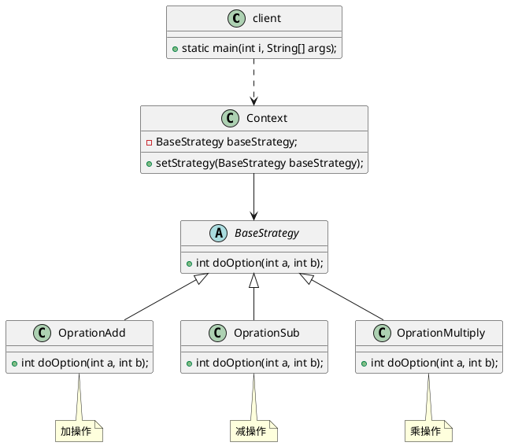

# Strategy Pattern

#### 图

```puml
@startuml
class client{
    + static main(int i, String[] args);
}

abstract class BaseStrategy{
    + int doOption(int a, int b);
}

class OprationAdd{
     + int doOption(int a, int b);
}
note bottom of OprationAdd : 加操作

class OprationSub{
     + int doOption(int a, int b);
}
note bottom of OprationSub : 减操作

class OprationMultiply{
     + int doOption(int a, int b);
}
note bottom of OprationMultiply : 乘操作

OprationAdd -up-|> BaseStrategy
OprationSub -up-|> BaseStrategy
OprationMultiply -up-|> BaseStrategy

class Context{
    - BaseStrategy baseStrategy;
    + setStrategy(BaseStrategy baseStrategy);
}

Context --> BaseStrategy
client ..> Context
@enduml
```