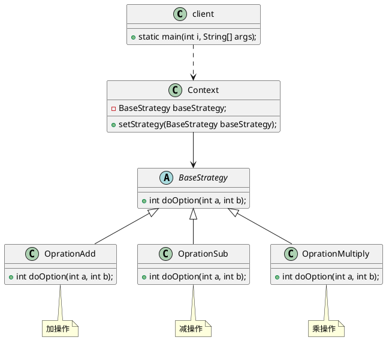

# Strategy Pattern

## 简介
策略模式言简意赅，就是策略。是对算法的封装。这样说着有些模糊，这个模式很简单，也有超多的变种。看代码比看文字描述更能体会。代码如下。

#### 图



```java
public interface BaseStrategy {
    int doOption(int a, int b);
}

public class StrategyAdd implements BaseStrategy{
    @Override
    public int doOption(int a, int b) {
        return a + b;
    }
}

public class StrategyMuit implements BaseStrategy{
    @Override
    public int doOption(int a, int b) {
        return a * b;
    }
}

public class StrategySub implements BaseStrategy{
    @Override
    public int doOption(int a, int b) {
        return a - b;
    }
}

public class Context {
    private BaseStrategy baseStrategy;

    public void setBaseStrategy(BaseStrategy baseStrategy) {
        this.baseStrategy = baseStrategy;
    }

    int execute(int a, int b) {
       return baseStrategy.doOption(a, b);
    }
}

public class Client {
    public static void main(String[] args) {
        Context context = new Context();
        context.setBaseStrategy(new StrategyAdd());
        context.execute(1, 3);

        context.setBaseStrategy(new StrategySub());
        context.execute(3,2);
    }
}

```