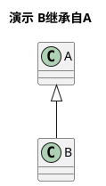
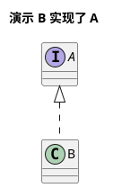
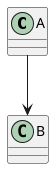
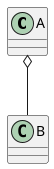
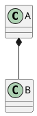

# 类图模板
##### 继承 实线空三角

##### 实现  虚线空三角

##### 关联  A 知道 B 的关系, 实现箭头。B 与 A 是八竿子打不着的关系，两个独立类，但是，A做某种事情，需要知道B怎么样。

##### 依赖 虚线箭头， B 与 A是八竿子打不着的关系，但是 A正常进行，必须依赖B，否则做不了东西

##### 聚合 一种松散的拥有关系，A中包含B， 但是B对象并不一定要是A的一部分

##### 组合 一种强的拥有关系，体现了非常严格的整体与部分关系, A 包含了 B, B 离了A无法独自存在，独自存在毫无意义

