# 类图模板
##### 继承 实线空三角
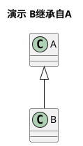

##### 实现  虚线空三角
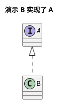

##### 关联  A 知道 B 的关系, 实现箭头。B 与 A 是八竿子打不着的关系，两个独立类，但是，A做某种事情，需要知道B怎么样。
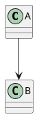

##### 依赖 虚线箭头， B 与 A是八竿子打不着的关系，但是 A正常进行，必须依赖B，否则做不了东西

##### 聚合 一种松散的拥有关系，A中包含B， 但是B对象并不一定要是A的一部分
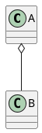

##### 组合 一种强的拥有关系，体现了非常严格的整体与部分关系, A 包含了 B, B 离了A无法独自存在，独自存在毫无意义
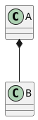

# 甘特图

### 定义/顺序/开始/结束
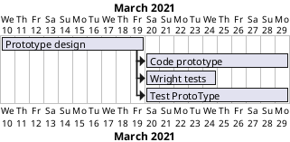

#### 简写名称/颜色/进度
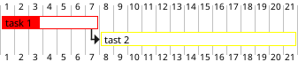
### 里程碑： 相对/绝对/最终

#### 相对
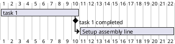

#### 绝对
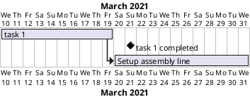

#### 最终里程碑/以及更高级的声明顺序语法  happens
```puml
@startgantt
[Task 1] lasts 4 days
then [Task 1.1] lasts 4 days
[Task 1.2] starts at  [Task 1]'s end and lasts 7 days

[Task 2] lasts 5 days
then [Task 2.1] lasts 4 days

[Maxtaskend] happens at [Task 1]'s end
[Maxtaskend] happens at [Task 2]'s end
[Maxtaskend] happens at [Task 1.1]'s end
[Maxtaskend] happens at [Task 1.2]'s end
[Maxtaskend] happens at [Task 2.1]'s end
@endgantt
```

#### 绑定链接
```puml
@startgantt
[task1] lasts 10 days
[task1] links to [[http://baidu.com]]
@endgantt
```

#### 日历
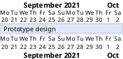

#### 日历颜色
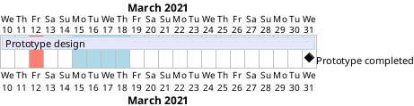

### 特殊单元块操作
关键词：
printscale
ganttscale
projectscale

关键词对应的值：
daily(默认)
weekly
monthly

#### 重点来啦！跳过节假日！完全自定义！关掉或开启特殊日期。牛皮啊！closed open关键词
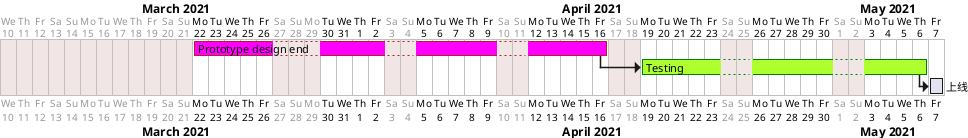

#### 设置甘特图日历的展示格代表的单位 
```puml
@startgantt
printscale weekly
saturday are closed
sunday are closed
Project starts the 2021/03/10
[Prototype design end] as [T1] lasts 19 days
[T1] is colored in Lavender/LightBlue
[Testing] as [T2] lasts 14 days
[T1] -> [T2]

[上线] lasts 1 days
[T2]->[上线]

2021/03/12 is colored in salmon
2021/03/15 to 2021/03/18 are colored in lightblue
2021/03/15 to 2021/03/18 are named [End's committee]
@endgantt
```

### 顺序  then， -> 不做多余描述了。都行.

#### 高端使用！资源分配一目了然.谁什么时间段有时间都能看得出来

##### 时间精细调整，相对位置，以及谁哪段时间请假，所有的排期都跟着改变
解决了节假日，倒班日，员工资源， 员工请假等诸多复杂情况下的排期问题
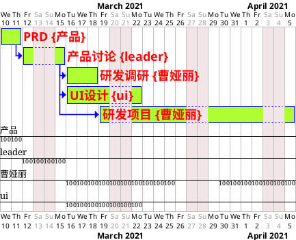