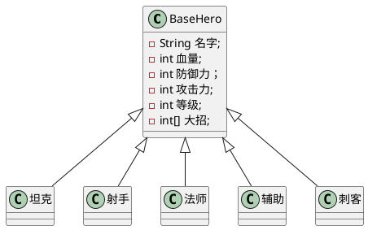
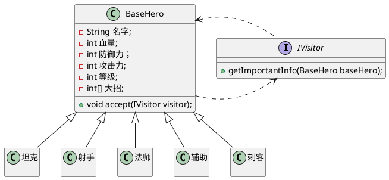
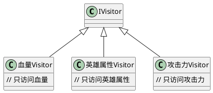
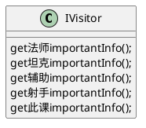

# Visitor Pattern

#### 网抄访问者模式概念
**在访问者模式（Visitor Pattern）中，我们使用了一个访问者类，它改变了元素类的执行算法。通过这种方式，元素的执行算法可以随着访问者改变而改变。这种类型的设计模式属于行为型模式。根据模式，元素对象已接受访问者对象，这样访问者对象就可以处理元素对象上的操作。**

```puml
interface IVisitor{
    void visitElementA(ElementA a);
    void visitElementB(ElementB b);
}
interface IElement{
    void accept(IVisitor visitor);
}

class ElementA{
    void accept(IVisitor visitor);
}
ElementA -up-|> IElement

class ElementB{
    void accept(IVisitor visitor);
}
ElementB -up-|> IElement

IElement .right.> IVisitor
IVisitor ..> IElement

class DataSturctor{
    - List<IElement> elementList;
    + acceptAll(IVisitor visitor);
    + addElement(IElement element);
    + cleanAllElement();
}

class Client{
    + static main();
}
Client .down.> DataSturctor
DataSturctor -left-> IElement
DataSturctor .left.> IVisitor

```

看这个图实在是一言难尽啊，我们从另外一个角度来简析这个模式吧。 咱们首先看看被访问者吧。从这个角色来理解。

假设我们有一个非常非常普通的数据结构。如下！


如果想让别人访问的话，其实相当好说，就是bean.getxxx(), 就得了是吧。 如果这样简单，根本就出现不了访问者了。

假设，我有个需求，让你花式打印这几种英雄的信息嘞。 这也就意味着，你面对每一个”花式“都得写一种算法。例如吧： 我想让你用英语，汉语，繁体，韩语，日语各自打印一些bean的自我介绍。

第一个反映估计是：
```java
if (汉语) {
    拿bean篡汉语
} else if (韩语) {
    拿bean篡韩语
}.....

也行是吧。但是不优雅。
```

你可以把每一套算法都封装成一个类，这个类里面，可以拿到数据，即这个BaseHero的引用，然后每一套类都会那这个数据，对其内容只读不写，根据读取出来的数据来做不同的操作。

访问者模式中的两个重要角色：
- 访问者--IVisitor
- 被访问者--BaseHero

角色关系： IVisitor 作为访问者， 拿到BaseHero这个被访问者的句柄，取出其需要的内容，来做他自身本身相关的算法。

模式初步

bean还是bean， 将转化为各种语言，算作不同的算法。 让这些算法能访问到这个bean，拿到bean，各自篡各自的文案。

在这些最普通的bean上，估计要加一些额外的方法，起码要有一个访问接口。但是接口不建议过多。网上通常一个接口，叫accept。 那么问题来了， 就提供一个接口的话，你怎么知道人家想捞什么数据呢？全部都给的话会很尴尬，不全部给的话，你又不知道给啥。所以要怎么搞呢？我们根据平常的场景，我们设定了被访问者，有没有发现，目前还没有访问者什么事呢。访问学那么答案来了，我们可以把这个访问者用上。外部向这些bean要数据的时候，不会直接用这些bean 去get，而是用这些访问者，去访问bean的数据结构中的每个元素。 写到这里，你是不是感觉，这个访问者最为直接访问真实数据的角色，是不是可以利用它来，对数据做一些”添油加醋“的操作，而不会导致原始的数据有改变呢？ 哈哈哈，层多了，留的空子就越多，当然可以喽。

**对于被访问者**
接收一个访问者，把自己的引用传给它，至于它拿到你自身的引用，去做什么，生成什么结果。这个你根本不用管。毕竟包揽的太多了不好。还不如搞一个比较通用的。而作为被访问者，你做好的事情，就是，管好自己的成员变量，不要老被别人改来改去。做好约束，比如把修改的权限收回，把读取的权限放开。定制好了规则，后来人写代码，只能在你指定的包内搞，并不会因此坏了结构。
```java
IBean{
    accept(IVisitor visitor);
}
```

**对于访问者**
Visitor作为一个访问者，并且一般是由客户端代码直接或者间接调用的，说白了，他可能具有较强的业务性，场景性。里面的接口，或许也是和业务相关的。所以嘞，这个访问者在此时，直接写一个基类接口， IVisitor, 可变性太大，具体也不知道写啥呀。先把规则定了再说。
但是总有一个方法得用来调用一下吧。我们暂时随便给一个方法把，否则例子要无法延伸了！

```java
IVisitor {
    String getImportantInfo(Bean bean);
}
```

**简单实现** 
```java
Bean {
    void accept(IVisitor visitor) {
        visitor.getImportantInfo(this);
    }
}
```
<font color=#ff000>这句代码，总结一句话，就是，Bean作为一个被访问者，接受一个访问者，实现的时候，把自身的句柄传给访问者，怎么传，就是调用一个访问者的方法，然后将自己的句柄作为参数喽。这个是访问者模式的核心。我把他当成核心。至于外部的花式调用啥的，都是浮云。</font>

***

那么这样的话，我们就需要再加点角色了，就是访问者角色。 然后再在这些bean里加一些能接受这些访问者的角色，把自己传出去，bean的职责已尽，该给的都给出去了，至于外部究竟能拿这个访问者访问自己，最终得到的是什么个结果，都已与自己无关。

类图进化：


***
外界怎么调用呢？

```java
private Bean mBean = new xxxxx();
private Bean mBean2 = new nnnnn();
private IVisitor mVisitor = new xxxVisitor();
private IVisitor mVisitor2 = new cccVisitor();

main(..., ...) {
    // 重点， bean.accept（）有没有发现，最开始也是bean句柄调用的。
    // 但是accept的访问者，是可以变化的，结果是根据这个访问者不同，从而打印的不同！
    mBean.accept(mVisitor)；
    mBean2.accept(mVisitor)；

    // 看吧，bean统一调用accept方法， 但是具体干了啥，完全仰仗IVisitor的实现具体干了啥。
    mBean.accept(mVisitor2);
    mBean2.accept(mVisitor2)；
}
```

#### visitor如何实现
```java
Visitor {
    String getImportantInfo(Bean bean) {
        if (bean instanceof 坦克) {
            return "坦克"  + bean.toString;
        } else if (bean instanceof 法师) {
            return "法师"  + bean.toString;
        } 
         // 以此类推 ...
        else {
           
        }
    }
}
```

#### 拓展
Visitor如果真的像这样实现，基本完全不能发挥其能力，上面已经讲过，Ivisitor是和业务相关的，很容易变化的。而且基本描述的是，拿到一套数据后的算法。比如我可不可以这样衍生？

或者我不衍生了！直接在visitor中加方法。 这个是网上通常看到的案例。我觉得这个使用起来不太优雅。反正我不会这么用。


