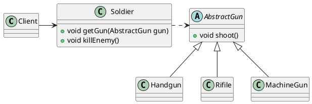

# SOLID-L 里式替换原则

总结一句话：基类出现的地方，子类一定可以出现。并且和调用父类的方法的效果一模一样(逻辑不改)

#### 里式替换原则的历史

首先提出一个问题：
有一个新功能P1,由A来进行完成。现在需要将功能P1进行扩展，扩展后的功能为P，其中P由原功能P1与新功能P2组成。新功能P则是由A类的子类B来完成，则B在完成新功能P2的同时，会有可能影响到原有功能P1，使P1发生故障。

#### 里式替换原则规则

上述问题的写法，采用集成在某些情况下是不可避免的。出问题的地方不是在于这种实现方式本身。所以在这里我们是不能做什么改动以解决这种影响的。我们要做的是，在使用继承的时候，遵循里式替换原则。不是教你非得将代码写成什么样，而是，写的时候遵循某种原则。<font color=00ff00>当类B集成类A的时候，除了添加新的方法以完成新增的功能P2外，尽量不要去重写父类A的方法，也不要去重载父类A的方法。</font>
<font color=ff0000>那么问题来了？对于Java而言，如果严格遵循里式替换原则，那重写和重载的特性岂不是永远不会被用到。那语言设计者还发明这种特性干嘛？奇怪！</font>

##### 里式替换原则包含了四层含义

- 子类可以实现父类的抽象方法，但是不可以覆盖父类的非抽象方法



```java
public abstract class AbstractGun{
    public abstract void shoot();
}
```

```java
public class HandGun extends AbstractGun{
    @Override
    public void shoot() {
        Systerm.out.println("手枪射击");
    }
}

public class Rifle extends AbstractGun{
    @Override
    public void shoot() {
        Systerm.out.println("步枪射击");
    }
}

public class MachineGun extends AbstractGun{
    @Override
    public void shoot() {
        Systerm.out.println("机枪射击");
    }
}

```

```java

public class Soldier{
    private AbstractGun mGun;
    public void getGun(AbstractGun gun) {
        this.mGun = gun;
    }

    public void killEnemy() {
        Systerm.out.println("士兵杀敌");
        this.mGun.shoot();
    }
}

```

```java

public class Client{
    public static void main(String[] args) {
        Soldier soldier = new Soldier();
        soldier.getGun(new HandGun());
        soldier.killEnemy();
    }
}

```
<font color=00ff00>在类中调用其他类时务必要使用父类或者接口（例如Solider类的setGun(AbstractGun gun)方法），否则说明类的设计已经违背了LSP原则。</font>


- 子类可以增加自己的特性
- 类的方法进行重载父类方法的时候，条件应该比父类更加宽松(<font color=ff0000>怎样才算宽松？</font>)--参数的类型更宽松。例如Map 和 hashMap， 前者就比后者更为宽松
- 复写或者实现父类方法的时候，输出结果可以被缩小(意思就是要兼容父类的结果，免得其他地方出问题)


#### 为什么会提出里式替换原则（用于解决什么问题）

就是为了避免提出的那种问题的出现[里式替换原则的历史](里式替换原则的历史)

#### 里式替换原则的优势

#### 里式替换原则如果理解错误会出现什么样的问题

#### 精髓

- 以后写代码的时候，在类中调用其他类的时候，务必要用父类或者接口作为句柄，这样写，我认为你就已经离里式替换原则的使用成功一半了。还好我平常就是这么写的。当时的原因是，我希望所有的都是抽象的。没想到这一点。没成想误打误撞遵循一半这个原则了哈哈哈
