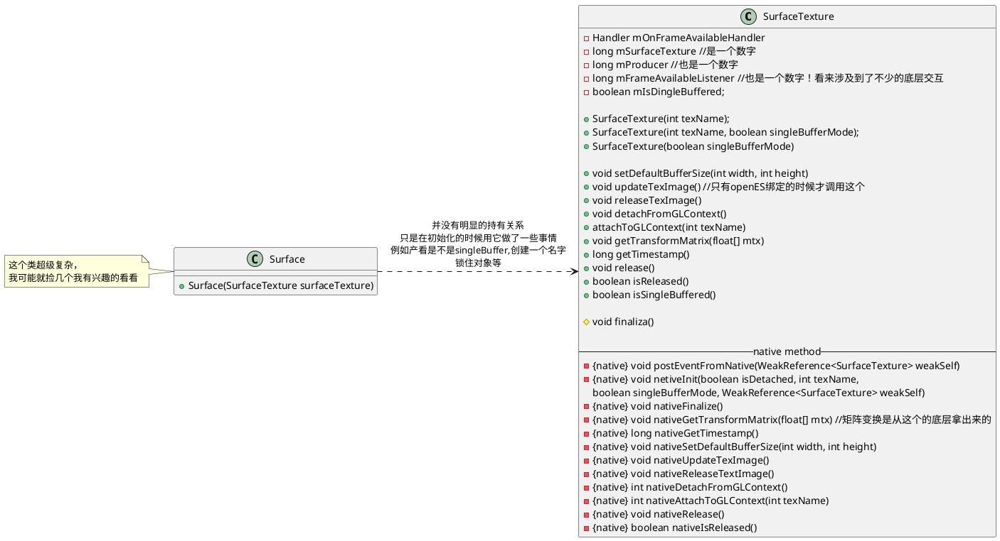
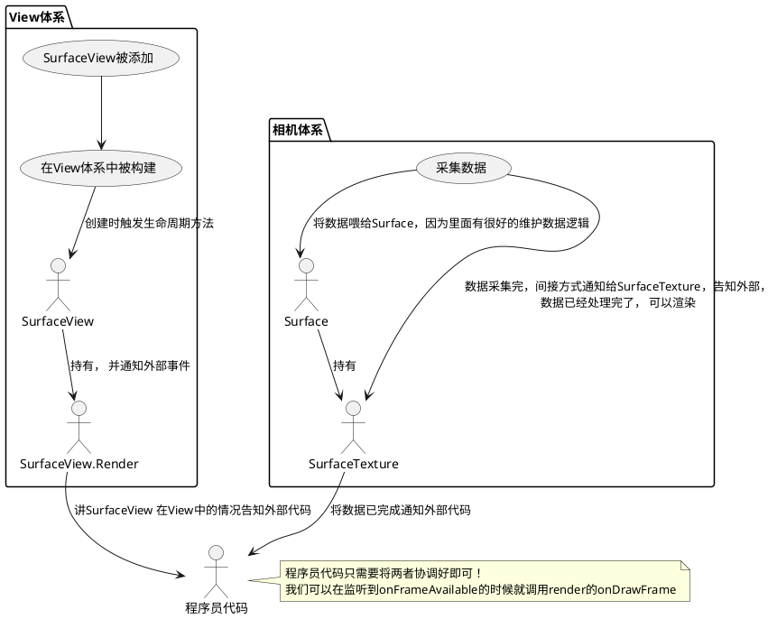

# 各种API的关系究竟是什么
我们先看看在代码上是怎么连上去的吧，这点真的，我已经彻底搞不清楚了，越写越搞不明白了！


# surface是啥
Surface对象使应用能够渲染主要在屏幕上显示的图像，，这意思是既可以是图像还可以是视频？？通过surfaceHoder解耦，应用可以编辑和控制Surface。
**Surface 和 SurfaceHolder 是一套**

暂时理解为它是一套屏幕缓冲区的管理类。它里面还有一个叫Canvas的对象。

mSurfaceTexture 每当有新的视频帧的时候，就会回调onFrameAvailable

GLSurfaceView.Renderer 的 onDrawFrame 不是平白无故就会被调用的，得靠第三方触发， 这个触发者有时候是我们自己


SurfaceView 会设置一个 GLSurfaceView.Renderer 这个是其API定下来的
所以 SurfaceView 有 setRenderer(); 但是render的方法，surface创建，创建完成的时候，会回调，画的时候不是自动化被回调的， 要靠别人调用，**render 是一个纯接口！！！！**， 你甚至可以理解为， 它就是一个callback

而 SurfaceTexture 是个啥呢？？我们看看流程推理一下关系

- 对于我们的相机代码，实际上直到调用预览的时候人家需要的是一组Surface对象，用于把数据喂到Surface对象中！我们上面也讲了，Surface里面维护了数据，并且它是 生产者和消费者之间的连结。显然，在相机的框架中，，肯定是其作为生产者，要把数据喂给Surface中维护的屏幕缓冲数据的！
- 然而有个比较细节的是，Surface这个对象在初始化的时候，会要一个叫 SurfaceTexture 的对象，在初始化代码中，人家直接拿这个对象去调用native方法创建东西去了！虽然java层没有明显持有这个SurfaceTexture， 但底层必然关联了！我有些好奇，这个SurfaceTexture绝对与消费者很有关系。

- 我们再在另外一个角度推理一个其他的细节，刚才说的那GLSurfaceView.Renderer，我说了，它只是个回调！我自己都亲测了，咱们之前其实主要就是在其``` public void onDrawFrame(GL10 gl) ``` 方法中实现的，这个比较类似于view的onDraw。 就是在这个方法中画就完事了，但是！如果你仅仅只是添加一个 SurfaceView 并且对其设置 SurfaceView.Render的话，不做其他动作，其只会回调onSurfaceCreated 和 onSurfaceChanged 。 我觉得这个和我们的view框架有强相关的，因为布局变化就会回调，至于视频数据渲染，至少现在看来，这俩回调八竿子打不着关系的！
- onDrawFrame 究竟是谁调用的呢？ 我看网上的内容，发现，这家伙是开发者自己调用的！下面是我看到的来龙去脉！

从上图中可以看出来，SurfaceTexture竟然和SurfaceView没有半毛关系！！但是SurfaceTexture可以设置一个监听！这个监听方法名字如下图所示：

onFrameAvailable！ 然后我们在里面的实现里，就是让SurfaceView调用 requestRender了！！！这个方法一旦加上，SurfaceView 中持有的 SurfaceView.Render 对象的 onDrawFrame 方法便会被调用出来! 那么我们就可以在里面进行绘制了！
- 那么问题来了， 怎么SurfaceTexture 会有这种监听逻辑呢？？？怎么来了数据它就能知道了呢？
  从上图可以看出来这个事件是被底层调用出来的！这个我们不得不联想到刚开始设置的流程，正好形成一个闭环： 



# 如何绘制，与OPGLES的关系
上述，只是讲到了Camera 和 View是以何种方式进行连结的。但是我们还没有讲是怎么绘制的。这个也是十分重点的内容
我们要解决以下内容
- 绘制内容从哪里来的呢？
- 怎么和opengl挂钩呢？

绘制的数据，必然起源于Camera，我们在图中，看到了， 数据在Surface中维护，Surface又和SurfaceTexture有着很强的关系，尽管现在时间不允许看代码，我们不妨猜一下大致的关系
- SurfaceTexture 是如何被创建出来的。我们上文提到过，这家伙没有多特别，直接new一个就行了！ 
代码中可见，构造方法很普通，但是 其参数很特别，是OPENGL创建出来的id，给了SurfaceTexture！！！
这样就关联上了，我原先以为，opengl肯定会和Surface直接交互，opengl就是其数据中的消费者，但是没想到人家直接和 SurfaceTexture绑定的。
- 我们看看SurfaceView，SurfaceTexture，opengl之间的关系和流程
  ```puml
  @startuml
    :opengl创建一个id;
    :SurfaceTeture用此id初始化;
    :开始预览的时候，用SurfaceTexture创建一个Surface，
    Surface surface = new Surface(刚才初始化的那个SurfaceTeture)
    ;
    :将新建的Surface喂给相机体系！ 这段代码行数不少反正就是这个道理就是了;
  @enduml
  ```
  