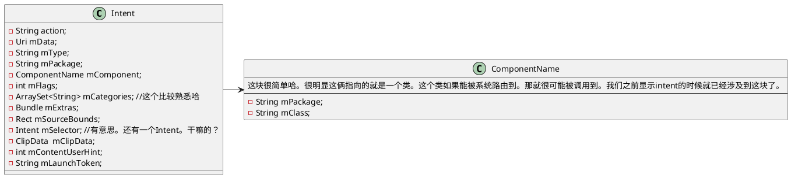

# Service启动与intent
讲真的话，因为一直做sdk，没有涉及到多个组件切换这种工作内容的原因。我已经将intent的使用方法差不多忘光了。趁着这次复习一下intent的使用方法，所以本文描述的不只是与Service使用有关的intent。而是所有。除了源码的我都会涉及。所以篇幅上会稍微长一些。

我们先从最基础的地方入手哈，尽管这些之前就清楚，但是为了之后能够快速将知识捡起来，多写点总归是有好处的。
## Intent

我们知道哈，Android有一些程序员不太接触的，但是FrameWork常常考到的“管理员”， 例如Activity管理，窗口管理，键盘管理等等。有时候管理员会收到一些被管理者的“指令”， 例如： “给我打开A Activity， 给我打开B 服务”。 等等这类的指令。 然后Manager得到这些指令之后，解析之后，就知道了这个指令是干什么的（意图是什么）。之后就再按照这个指示找出相关的组件，纳入管理并开启，就成了。

指令，就是Intent！ 也就是意图。“Intent在这里起着一个媒体中介的作用，专门提供组件互相调用的相关信息，实现调用者与被调用者之间的解耦。”文章是这样说的。但是我认为讲的太空洞了。实际上我更偏向于，这块的开发者在接到这种需求之后，第一个反映就是一定要将指令抽象出来，供各个组件与管理器之间用。这个才是正常的场景呢。而不是在产出结果中硬加意义。换谁都应该这么开发，这应该是常识了。

说着不讲源码的，但是说道这里我觉得。好像必须得讲这块。

## Intent用处
- 开Activity
- 发广播
- 开服务

对，你会发现并没有想象中那么混乱。

## intent种类
### 显式
显式intent，他的用法，直白一点的解释是： <font color=blue>启动的时候，直接指名道姓！我就要开谁谁谁！</font>

#### 第一种指名道姓方式-直接指出我到底要开哪个组件。
当然这里很明显，这个组件肯定是你的工程中能捞到的。如果目标Activity根本就不在你的项目中。那么不好意思，你要采用第二个方式去打开。
```java
Intent intent = new Intent(ActivityA.this, ActivityB.class);
```
或者
```java
Intent intent = new Intent();
intent.setClass(ActivityA.this, ActivityB.class);
startActivity(intent);
```

#### 第二种方式-利用Component指名道姓。 当然你也可以把它用开跨应用的组件哈。

```java
ComponentName component = new ComponentName(ActivityA.this, ActivityB.class);
Intent intent = new Intent();
intent.setComponent(component);
startActivity(intent);
```
Component 的构造方法有很多种的，其中就有一套，全接收String串！那么这样的话，就为我们做跨应用开组件提供了方案。例如下面的实现：

```java
Intent bindAppIpcServiceIntent = new Intent();
ComponentName componentName = new ComponentName("com.example.serviceipcdemo",
                        "com.example.serviceipcdemo.TestIPCService");
bindAppIpcServiceIntent.setComponent(componentName);
bindService(bindAppIpcServiceIntent, mAppServiceConnection, BIND_AUTO_CREATE);
```

### 隐式
隐式的话，表达就可能会有些隐晦了。他会描述出他想开组件的大致特征，但是不会提到底会开什么。例如，“我想开启手机内和地图相关的应用”。但是就不说是哪个应用。其实只要是有地图能力的都可以。
这个我们平常经常会遇到这个。就拿打开地图为例。用户触发了打开地图的代码。如果你手机上有不止一个可以提供这种能力的应用的话，系统可能会弹出一个选择框让你选哪个应用。例如我手机里面，有高德地图，百度地图。当我们点击开启地图的时候，系统就会弹出这俩让你选择。除非你只有一个地图应用。就会直接跳到那个地图里。

所以吧，我觉得其实隐式调用更体现Android系统生态的设计。嗯。
我们主要看的是要怎么调用才能是隐式调用，并且在AndroidManifest如何设置，才能支持隐式调用，以及其他的扩展点。

#### 使用方式
这个使用方式吧有点五花八门。我想有必要在真正的调用之前，了解一下，Intent的大致代码。它到底支持啥！这样才能知道要怎么使用。


