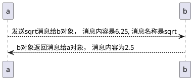

# 声明
```C++
#include <iostream>
int main
{
    using namespace std;
    int carrots;  // int , 说明开的内存是多少，carrots 说明这段内存空间叫carrots，名称就叫这个， 所以仅仅这一个简单的语句其实是做了两件事情的。
    carrots = 25;
    cout << "I have";
    cout << carrots;
    cout << " carrots."
    cout << endl;

    carrots -= 1;
    cout << "Crunch, crunch, Now I have " << carrots << " carrots." << endl;
    return 0;
}
```
int carrots 就是声明语句，意思是告诉编译器，你需要多少内存，以及内存单元的名称。编译器看到后会帮你填充哪些复杂的内存申请语句。这个都不用我们去管。

C++是一个强制声明类型的语言，如果你写过python脚本或者是shell脚本的话，你可能会觉得 C++这样做会搞的我们写代码很麻烦，但是正因如此，它恰好可以避免用户拼写错误，或者其他失误情况出现的问题。

像 int carrots这样的代码，触发的是c++的定义声明语句，只要这个语句一来，就会导致编译器为内存分配空间，这种语句称之为定义语句，也叫**定义声明**， 简称定义。 例如：定义一个变量。
但是仅仅声明，不止这一种方式呢！还有一种声明，叫**引用声明**，这种引用声明会导致编译器使用在其他地方声明的变量。这种声明就不能称之为定义了，并且这种情况相对来讲是比较复杂的。

## 声明相较于C语言进化点
在C语言中通常会将所有的声明都集中在头部，其实事实上怎样我也不知道对不对，反正我懒得验证去，但是C++就不一样，你只需要在用到的时候之前声明一下就行。 （PS： 这他妈太low了！）。

# 赋值语句
赋值语句相当简单啊，就是 xxx = xxx; 我费时间写这段原因是，C++可以 xxx = xxy = xxz = 20; 会引发从右向左进行赋值， 但是具体细节是这样的： 
20 赋值给 xxz  xxz之后的值为20
然后将xxz 值赋值给 xxy
然后将xxy 赋值给 xxx

# 其他语句
```
cout 会使用
cin会使用
这些使用啊，讲真，至少android开发中不会用到，所以我觉得即使不学也可以。
```

# 类的简介
- 类，是数据类型，操作组合，用户自己定义的！这个其实是本质。
- 类与对象的关系，诸如数据类型和某一个数据类型的特定变量之间的关系
  
以 cout 为例，cout 是一个ostream对象， ostream类呢，描述了这个类中含有的数据结构，以及它能执行什么操作，如将一个特定的数字插入到输出流中去。
同理， cin， 也是istream类的一个对象， 看没看出来 ```include <iostream>``` 起名的含义！这家伙的前面两个字符分别代表in 和 out。这么多年我一直理解错了！
**类，描述了一种数据结构的全部属性以及其包括的操作， 对象只不过是根据这些描述，创建的实体**
**<font color=red>私以为，“描述” 二字，用的相当精妙！！赞！</font>**

## 内置到编译器中的类和没有被内置到编译器中的类。
为什么要写 ```include <iostream>``` 这个字眼， 但是为什么你声明一个int类型却不需要专门的include呢？ 原因是：iostream这个东西呀，没有被内置到编译器中！但是这种类相较于我们自己实现的类还是比较特殊的， 特殊的点，在于，人家是C++标准库里面的内容， 同样C++标准库还有许多其他的类，此处不列出了。一般这种库啊，相当通用，存在大量的类都支持UNIX， MACINTOSH 和 Windows编程类库，比较好用。 不过到这里，我依然认为， java YYDS！

## 消息 & 方法
我发现所有官方描述，都将调用方法描述为，发送消息！这是个人感悟

# 函数
基本特性
```c++
x = sqrt(6.25);
调用函数sqrt， 消息内容为 6.25。 发送回去的内容是 2.5， 也就是返回值
```

我觉得吧这种理解太过拟人化。 如果了解底层原理，就知道这样解释是有些牵强的，只是为了方便别人理解罢了。

## 函数原型语句
简单理解，你想要编译器正确的处理这套发消息收消息的机制，那么必须就得以一种方式让编译器知道，你的函数， 名字叫啥，返回值是啥，参数是啥，要不要有异常。如果不告诉它，编译器将没办法解释你写的是个啥东西！为编译器提供这套信息的方式，就是要采用函数原型语句。
函数原型语句你绝对见过：