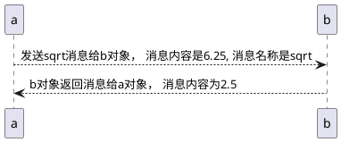

# 声明
```C++
#include <iostream>
int main
{
    using namespace std;
    int carrots;  // int , 说明开的内存是多少，carrots 说明这段内存空间叫carrots，名称就叫这个， 所以仅仅这一个简单的语句其实是做了两件事情的。
    carrots = 25;
    cout << "I have";
    cout << carrots;
    cout << " carrots."
    cout << endl;

    carrots -= 1;
    cout << "Crunch, crunch, Now I have " << carrots << " carrots." << endl;
    return 0;
}
```
int carrots 就是声明语句，意思是告诉编译器，你需要多少内存，以及内存单元的名称。编译器看到后会帮你填充哪些复杂的内存申请语句。这个都不用我们去管。

C++是一个强制声明类型的语言，如果你写过python脚本或者是shell脚本的话，你可能会觉得 C++这样做会搞的我们写代码很麻烦，但是正因如此，它恰好可以避免用户拼写错误，或者其他失误情况出现的问题。

像 int carrots这样的代码，触发的是c++的定义声明语句，只要这个语句一来，就会导致编译器为内存分配空间，这种语句称之为定义语句，也叫**定义声明**， 简称定义。 例如：定义一个变量。
但是仅仅声明，不止这一种方式呢！还有一种声明，叫**引用声明**，这种引用声明会导致编译器使用在其他地方声明的变量。这种声明就不能称之为定义了，并且这种情况相对来讲是比较复杂的。

## 声明相较于C语言进化点
在C语言中通常会将所有的声明都集中在头部，其实事实上怎样我也不知道对不对，反正我懒得验证去，但是C++就不一样，你只需要在用到的时候之前声明一下就行。 （PS： 这他妈太low了！）。

# 赋值语句
赋值语句相当简单啊，就是 xxx = xxx; 我费时间写这段原因是，C++可以 xxx = xxy = xxz = 20; 会引发从右向左进行赋值， 但是具体细节是这样的： 
20 赋值给 xxz  xxz之后的值为20
然后将xxz 值赋值给 xxy
然后将xxy 赋值给 xxx

# 其他语句
```
cout 会使用
cin会使用
这些使用啊，讲真，至少android开发中不会用到，所以我觉得即使不学也可以。
```

# 类的简介
- 类，是数据类型，操作组合，用户自己定义的！这个其实是本质。
- 类与对象的关系，诸如数据类型和某一个数据类型的特定变量之间的关系
  
以 cout 为例，cout 是一个ostream对象， ostream类呢，描述了这个类中含有的数据结构，以及它能执行什么操作，如将一个特定的数字插入到输出流中去。
同理， cin， 也是istream类的一个对象， 看没看出来 ```include <iostream>``` 起名的含义！这家伙的前面两个字符分别代表in 和 out。这么多年我一直理解错了！
**类，描述了一种数据结构的全部属性以及其包括的操作， 对象只不过是根据这些描述，创建的实体**
**<font color=red>私以为，“描述” 二字，用的相当精妙！！赞！</font>**

## 内置到编译器中的类和没有被内置到编译器中的类。
为什么要写 ```include <iostream>``` 这个字眼， 但是为什么你声明一个int类型却不需要专门的include呢？ 原因是：iostream这个东西呀，没有被内置到编译器中！但是这种类相较于我们自己实现的类还是比较特殊的， 特殊的点，在于，人家是C++标准库里面的内容， 同样C++标准库还有许多其他的类，此处不列出了。一般这种库啊，相当通用，存在大量的类都支持UNIX， MACINTOSH 和 Windows编程类库，比较好用。 不过到这里，我依然认为， java YYDS！

## 消息 & 方法
我发现所有官方描述，都将调用方法描述为，发送消息！这是个人感悟

# 函数
基本特性
```c++
x = sqrt(6.25);
调用函数sqrt， 消息内容为 6.25。 发送回去的内容是 2.5， 也就是返回值
```

我觉得吧这种理解太过拟人化。 如果了解底层原理，就知道这样解释是有些牵强的，只是为了方便别人理解罢了。

## 函数原型语句
简单理解，你想要编译器正确的处理这套发消息收消息的机制，那么必须就得以一种方式让编译器知道，你的函数， 名字叫啥，返回值是啥，参数是啥，要不要有异常。如果不告诉它，编译器将没办法解释你写的是个啥东西！为编译器提供这套信息的方式，就是要采用函数原型语句。
函数原型语句你绝对见过：就是项目里面有的头文件里面，一堆看起来像方法声明的东西，但是没有具体实现。这种基本就是函数原型了。
函数原型之于函数相当于变量声明之于变量。 如 ``` double sqrt(double);``` 这样的代码，这种声明必须以分号为结尾。因为只有这样才能凑出一条语句出来，以告知编译器，这是一个语句， 如果你不加分号，则编译器会将其解释为一个函数头，并接着就会要求提供函数体。
在其他程序中使用这个函数的时候，其实是必须要带这个函数原型的，但是你想想，如果我们都加函数原型的话，写起来时机是比较麻烦的。所以才有了诸如： ```include xxx.h```这类包含头文件的预编译语句帮你做这件事。在C++库中的每个函数其实都在相应的头文件里面提供了原型。只不过这些头文件的分布，着实让我看着分不清楚。文中说一个或者多个。我的天哪，所以到底要有多乱！！！

### 函数原型与函数定义区分
函数 原型与函数定义完全是两码事！原型只是做了一个简单的描述而已，例如接收那种类型，输出什么类型， 而函数的定义则包括了参数的名字，以及函数的实现。这个java中的接口和接口实现，看起来像，也不像。有那么点相似。

在C和C++中，原型和定义是拆开看的。因为这样，必然会出现的发展结果就是， 头文件里面基本就是函数原型汇总， 而函数的实现则在另外的文件里，这种文件是库文件。 简单点，也就是， 库文件与头文件，是分割的！

**在首次使用函数之前，务必提供其原型！通常的做法是，把原型放到main方法之前。**

```c++
#include <iostream>
#include <cmath> // include 实则存在大量的原型。 位置正好在main方法之前。是可以的！

int main(int argc, char const *argv[])
{
    using namespace std;
    double area;
    cout << "Enter the flooter area, in squara feet, of your home";
    cin >> area;
    double side;
    side = sqrt(area);
    cout << "side=" << side << endl;
    /* code */
    return 0;
}
```
## 函数变体

实际上就是多参数的函数，或者一个参数也不接受的那种函数！太简单了！但是对于哪些没有参数的函数，他们的函数原型是：
```int rand(void)```此类的写法。
在有些语言中，有返回值的函数称之为函数，没有返回值的函数称之为过程。

## 用户定义的函数
上面我们已经写到，就算是标准库，其实也是存在某处一定有函数的原型的。 如果用户自己编写函数的话，也是要遵循这个标准的。也就是说，你也得写原型。
```c++
# include <iostream>
void simon(int);
int main() 
{
    using namespace std;
    simon(3);
    cout << "Pick an integer:";
    int count;
    cin >> count;
    simon(count);
    cout << "done!" << endl;
    return 0;
}

void simon(int n)  //函数头
{
    using namespace std;
    cout << "Simon says touch your toes " << n << " times." << endl;
}
```

函数的基本写法可以抽象为如下公式。

```c++
type functionName(arguments)
{
    statements
}
```

## main方法的返回值
main方法的返回值实际上是一个int，这个返回值其实并不是返回到当前程序的其他部分的，实际上是返回给操作系统。通常如果返回值是0的话，会被认为是成功。这样的话我们便可以在外部写出一个脚本或者其他的批处理程序的。
还记得你之前写脚本的时候，会对返回值进行判断吗？他们为什么那么统一的给出返回值？原因就在这里，全行业统一的。

# 关键字
记住一点就行， main不是关键字，但是你最好别那这个乱用，因为有前车之鉴，我说的乱用，指的是，起一个变量名叫main， 连这个都不可以，因为有些情况下，编译器会“糊涂”
还有标准库里面的一些比较著名的词，最好避开，比如 cout， 最好不要乱用

# 用户定义的有返回值的函数
```c++
# include <iostream>
int convert(int);
int main() 
{
    using namespace std;
    cout << "请输入斤数，我们将转换为千克";
    int i;
    cin >> i;
    cout << "您刚才输入的是" << i << "斤"; 
    i = convert(i);
    cout << "转换的结果是" << i << "千克"; 
}

int convert(int i) {
    return i * 2;
}
```

## 函数的特性
- 有函数头和函数体
- 接收一个参数 //?? 不一定啊明明
- 返回一个值 // ??
- 需要一个原型

## using 编译指令
我们原先的例子中只是在函数实现的内部加上了using指令，但是事实上这个指令是可以写在函数外面的，写在头部。这个指令已经提到了，他是个编译指令。事实上你可以不写这个，但是一旦不写这个的话，在用到的时候你就要写出你要用到的cout全部的路径了，这个是很麻烦的，一般习惯上，用到的次数多的话，我们会写在最前面
```c++
using namespace std;
...
int main() 
{
    
}
```