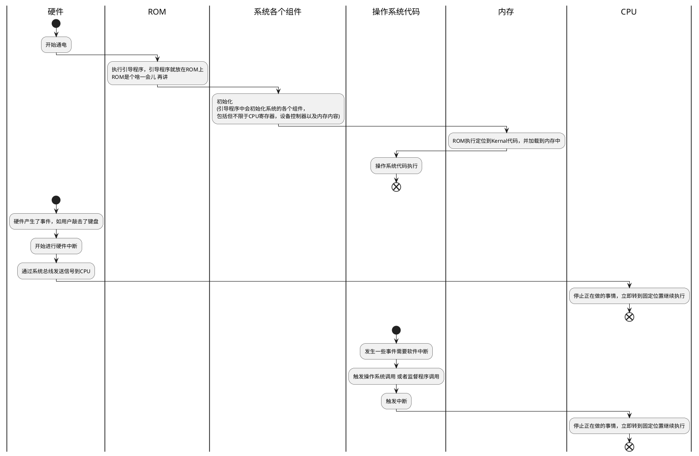

一写写了一章，没想到啊没想到
# 操作系统概念
- 理论位置:处于计算机用户与计算机硬件之间
- 目的：为用户提供一个便捷高效执行程序的环境
- 功能是：它是软件，用来管理计算机硬件的软件，因为软件，并且操作系统是一个非常复杂的软件，所以我们在设计这个系统之前，就要把明确界定系统目标作为重中之重，分块构造，并且有严格的输入输出功能。

操作系统根据计算机的用途和类型会有所不同
- 大型机操作系统（商用）
- 个人计算机
- 移动计算机

计算机系统的四大组件
- 硬件
- 操作系统
- 应用程序
- 用户
  
我们常讲的，不好的代码可能会造成资源的浪费。这里的资源指的具体是什么
- CPU时间
- 内存空间
- IO资源
- 文件存储空间

故，我们优化代码的时候也会从以上四个角度去优化。

**内核这个概念的引申**
内核这个词是由操作系统概念而来的，下面我抄一下概念--操作系统是一直运行在计算机里的程序，俗称内核。但是还有个容易混淆的概念我们一定要搞清楚哈：就是系统程序和应用程序。这俩都不是内核！系统程序指的是和系统运行有关的程序，但不是内核，应用程序指的是与系统运行无关的其他程序。
所以在我这里看来，内核是保命的， 系统程序是在保命的基础上增加能力的。而应用程序是锦上添花用的。
而我看的**这本书里，对操作系统的定义是比较保守的，人家就是指的内核那一部分。**

对于移动端的操作系统，用到了操作系统内核和中间件。

# 操作系统组成
简而言之，现在通用的计算机系统，包含了一个或多个CPU和若干个设备控制器，他们通过公共总线相连而成，同时总线提供了共享内存。如下图：

# 计算机开机的时候都发生了啥

上述产生了两个疑惑
1 中断是啥
2 ROM 这个在接下来讲的计算机存储导论这块讲

# 中断是个啥？
这个词老有名了，我上学时竟然还能把这个词跟“断言”混为一谈。
中断，是计算机体系里面十分重要的一个部分。所有的计算机体系都有这个！无一例外哈！中断就像书中说的那样。中断是一个信号，CPU收到就会停止当前的事情，转头去执行信号中带的地址里的指令。
对于这块我有一个思考。通常对于两个不相干的事物，一个事物A要对B的变化做出相应的反应。这种其实就是说的CPU与硬件哈。我们抛开计算机这个学科的话，要解决这种问题其实通常是有两个很普遍的方案的
- 1 B发生了变化，主动通知A说自己变化了。A再进行处理就行了(这个就是中断用以解决的这类问题)
- 2 第二种方案是，B发生变化不给A说，A会定时检测B是否发生了变化，如果发生了变化就会做一些处理。
- 这两种方案都可以完成。但是对于计算机而言，它是要接很多设备的，不同的设备有不同的特点。比如说键盘设备。其实大部分情况下，用户不会点击按键。这才是常态哈。那么上述的两个方案对于处理这种情况，显然第一种方案是比第二种方案好的。因为B的触发频率不高！如果采取第二种方案，那么就意味着A的很多次询问中，只有少的可怜的询问会碰巧遇到B变化，大部分询问是无效的。在CPU与设备这种情况下，与其CPU主动问，不如设备主动报备！
- 那么这种情况下，报备，就是我们理解的中断
但是我们不得不引申一下了！中断信号有时候会很多，如果没有个管理器，会很不像话！没办法处理。所以操作系统会有一个专门的“中断服务程序”来统一处理中断事宜。

中断到底多重要？
答：我们现在的操作系统是中断驱动的(说白了就是事件驱动)！没这家伙没法跑。就是这么重要！对于中断而言，操作系统会提供专门的**中断服务处理程序**来进行统一管理。但是无论内部的机制到底如何复杂，其目的都是让计算机能够合理的处理这庞大且种类繁杂诸种中断，确保不会出错。并且无论怎么处理都会百转千回的转到操作系统响应这些中断的代码中。每种中断，操作系统都有不同的**代码段**来进行处理。

中断分类
- 硬件中断
- 软件中断这个详细分下（我想软件中断的实现机理书中肯定会有更加详细的原理描述的！）
  - 陷阱（trap）或者异常（Exception），嗯异常的本质实际上是一种软件中断机制。以后再有人问你，请你跟他说本质原理。传道解惑。
  - 用户程序的特定请求
  - 其余的应该还有不少，但是书上没有提及。我想这个应该不是什么重点。

好吧我看了一大段，到底不知道IO的精准定义是个啥子。。。

# 存储
分类如图。只是大概的。

## IO结构
IO按照我们的第一反应，就联想到了文件的读写是吧。实际上文件的读写只是IO庞大体系中的一个小小的部分。操作系统的大部分代码其实都是在写这个IO。可见IO对操作系统至关重要(可靠性，性能)。那么IO到底指的是什么呢，具体是哪些呢？
IO你可以理解为CPU与各种硬件打交道时产生的行为。例如键盘上点击了一个键，数据怎么着也得到CPU那里处理的。

### 小容量存储设备IO，如键盘设备
- 1 首先，硬件上来讲，计算机系统是由一个或多个CPU， 与多个设备控制器组成。他们都是可以看得到的硬件设备。这俩的连接，是靠共同的总线连接到一起的。如图，一个CPU对应多个设备控制器。连接用总线。然后设备控制机器才与我们经常见到的哪些设备进行连接，例如鼠标，键盘。为什么讲硬件，原因是，有很多情况下，动作是由硬件触发的，例如点击键盘的一个键。我们得从这里为出发点向深层推论。另外硬件的**设备控制器是可以产生硬件中断**，直接通过总线告知CPU的。好让CPU暂停当下执行的工作，执行这个硬件中断里面的信息中携带的代码操作位置。那么这段代码是什么代码呢？请看第二点。
- 2 硬件上有动作，总归是要跳转到软件上执行相应代码的。上述设备控制器产生中断之后，CPU就会执行到对应的设备驱动代码中。完成从硬件产生信号到执行软件代码这一“看似抽象”的过程。
- 3 对于设备控制器而言是由相应的驱动程序需要安装的。并且不知道你有没有注意过，一般下载驱动的时候，是严格按照电脑型号进行下载的。并不像普通的软件那么自由。为什么呢？我觉得就是在于设备控制器产生的中断信息这里。设备控制器是硬件啊！产生的终端信息里面带有的执行代码位置，应该是固定的！既然是固定的，那么久意味着驱动的代码的某行关键代码必须要和设备控制器中的信息保持一致！一旦匹配不上，可能内置就找错了，找错位置，不过操作系统不加以阻止，那么不好意思，崩溃蓝屏。
- 4 只要到了驱动程序这块的范围，那么一切就好说了，因为设个家伙是与操作系统“联系”的。他会返回控制到操作系统层面。至于之后漫长的处理程序我们就不做讨论了。点到为止。

为了比较方便记忆这个过程我整理了一个图：

### 大容量存储设备IO， 如专门的磁盘
上述我们讲到了，内存比较小的设备，可以依靠设备控制器的中断来进行硬软转换，巧妙的触发到操作系统代码。
但是面对存储硬件设备，就不能靠这招了。你想想，存储设备就是用来存储数据的，并且会涉及到大量的数据读取写入操作。如果按照上面那种小容量设备的处理方法。很可能出现传一个字节就中断一次。数据量那么大。这么老中断法肯定是不行的的，
所以，势必要给出一套合理的方案来解决这种频繁中断的问题。于是就诞生了一个技术--DMA(Direct memory access)--直接内存访问技术。 这个是我们学习的重点！

我看书的时候对这块是很感兴趣的，就是存储这块哈。为了研究DMA是个啥，他到底干了什么，我顺藤摸瓜，发现在了解这块的基础上哈，我们得好好的了解几个概念。我觉得有些概念是十分常见的，但是我并不认为那些觉得自己懂了的人是真的懂了。所以当你看到这里的时候，不要嘲笑我竟然连这么简单的都要科普一下。因为我真的觉得学习飘的人很多，不懂装懂，扯犊子一套套的误人子弟。
#### 缓冲区
我们前面不是讲了内存么。内存属于存储设备，但是存储设备不只有内存这么一个玩意儿。哈哈他还有外存哈，别忘喽。那么缓存是个啥呢？说白了哈，是内存的一块区域，精确点是RAM（Dynamic Random Access Memory 动态随机访问内存）的一块区域哈。所以缓存这个东西严格讲它是软件领域上的一个概念，具象化就是RAM的某处区域哈。广义上来讲它就是软件维度上的一个概念。那么它是干嘛的呢？
那么为什么在软件维度上出现这么一个东西呢？其实要从硬件层面上来考虑。
- CPU执行速度非常快非常快非常快！ 在很多场景下呢，我们的存储设备有很多种，之前我们已经总结过了。快的慢的都有对不对？
- 前几个自然段的讲解种已经提到了，在处理用到内存较大的设备时，我们不可能传一个字节就来一次中断吧！要是真的这样CPU也别干其他的活了，光执行中断就有的忙了！严重耽误工作！那么这个的意思就是，我们可能传很多的字节之后来一次中断。减少CPU处理这种根本就没有用的工作从而使其解脱出来可以在空闲期间去处理别的事情。
- 那么好！我们顺着这个思路去想，怎么实现让存储设备(外存其实是)传完若干数据(反正要比bit大)之后， 就通知CPU呢？也就是来一次中断？
  - 好，已经确定了我们传若干数据再发中断。 那么这个若干数据要存哪里呢？其实如果我们什么都不懂的话，肯定会想，这还用存啊？直接让CPU和这个外存打交道，外存本来就存了啊！但是我们这个想法太简单了，一个大难题就是外存这家伙的速度慢啊！比起CPU的确不怎么快。他俩直接交互我们可以想象出一个画面就是： CPU说老弟给我数据，外存说好的哥我给你，然后过了好长好长时间，这家伙才传了第一个字节给cpu,若干年后，外存终于将最后一个字节的数据给了CPU。对于CPU而言，少数时间在处理数据，大部分时间啥也不干就干等着。这不是相当有问题么？问题的症结在哪里呢？很明显就是二者读写速度差距过大！快的那个总是等慢的，被占用着还干不了其他的活。造成资源的浪费。
  - 因为这个原因，上述方案是不可以的，然后解决办法呢，就是缓存这个概念。RAM其实是一个与CPU总线直接接触的硬件了。它的传输速度是很快的，起码不会拖累CPU那么严重哈。并且RAM里面会存储操作符操作数这类的机器码程序。CPU就是一条条读的这种运行。CPU就是一个没有灵魂的执行机器，灵魂在RAM里哈哈哈。缓存就是借助了RAM很快这一点，在RAM里划一块区域用作缓冲区。RAM右手与CPU打交道，左手与外存打交道。外存传数据给RAM，到了一定的量之后，还能利用先天优势给CPU弄个中断过去。在RAM与外存传输的过程中呢，CPU不必等，直接干原来的活就行了。等来了一个中断之后，CPU会从这块缓存中读数据处理，他们之间读起来速度就相当快啦。也不会导致CPU读8、32、64位数bit 01010001 这种数据老是等等等的了。从而解决了这种CPU的浪费。

缓存的出现原因了解到此为止

#### DMA到底是干啥的
从缓存的引申里面，我们已经知道了，在RAM里面开辟一段内存区域，外存会将数据先传给RAM，等传满了缓存的量之后，通知CPU处理。是吧。那么DMA是干嘛的呢？他就是用来实现这套规则的，是一个技术。DMA既实现了缓存和存储设备之间比较安全的传数据(CPU要是和外存直接打交道，因他们先天存在的速度频率问题，实际上还会存在丢数据，数据不真的问题。不安全。这个太底层了我们不深入研究)，还一并包办了发中断这个任务。他就是实现本地缓冲和设备之间传输数据这么个事儿的。当然这个设备，应该不只是存储设备！所以它的应用范围应该比想象中的宽泛！就是这么个概念。

# 计算机的多道程序设计思想及延伸

首先我们解释一下多道程序，这是一个计算机能力。指的是单个CPU可以同事执行多个程序的能力。多道程序设计通过安排作业使得CPU总会有一个执行作业，从而提高CPU的利用率。
具体场景是这样的：
比如IO操作中，当IO操作过程中，对于非多道程序而言，CPU是会有空闲的，但是对于多道程序而言，CPU此时会简单的切换到另外一个作业，这样就能提高CPU的使用率了。
大致实现思路如图所示：

操作系统在内存中保存多个任务，但是这个主存容量太小往往不足以容纳所有的程序。所以这些作业首先是保存在磁盘上的作业池里的。作业池包含磁盘上的，和等待分配内存的所有进程。
我们常见的分时系统或者说多任务实际上就是从多道程序这里延伸出来的。

## 其他名词了解-之后会慢慢学
我在这里仅仅写了非常简单的一些关键点。因为之后会学，我们先留一个印象就够了。
分时系统
- 要求计算机可交互的，意味着连接多设备
- 允许多用户

作业调度与CPU调度
虚拟内存

# 双重模式与多重模式的执行

## 双重模式
双重模式是个啥，如果你不熟的话，作为Android的开发人员，用户态和内核态这俩你总听说过吧。双重模式其实指的就是这俩模式。只不过这个叫法更加学术化哈。
为了确保操作系统的正确执行，必须将操作系统代码和用户代码加以区分的。其实这个很容易理解的，做好区分的话，至少用户代码出问题的时候不会牵连操作系统出问题，并且操作系统会对这种情况进行监听，会将这种异常做妥善的处理的。
这两个模式具体是什么？
- 用户模式
- 内核模式（他有几个别称，如果你在别的文章中看到了这些词汇，就应当知道他们指的都是内核模式。这几个别称是： 监视模式，系统模式，特权模式。）

对于这两种模式的区分，计算机硬件中专门提供了一个模式位来表示当前是处于什么模式。0 内核 1用户。当计算机执行用户应用的时候，这个位的模式标记位1， 当这个用户应用进行系统调用的时候，系统就切到内核模式了。这个模式位置为几，其实也是通过中断来的，收到了中断，就会切。

双重模式位程序的执行提供了保护，那么怎么保护的呢？就是不允许用户程序调用一些危险的操作。比如可能会引起硬件损坏的**特权指令**，这种指令是有标志位为内核状态的时候才能允许执行，用户模式下是不会执行的，并且会认为你调用的指令为非法指令，以异常的形式通知操作系统！
思考： 读写文件这种操作是涉及到硬件了，在读写的过程中，是处于内核态还是用户态？

操作系统可真是庞大啊。感觉面向程序员开发才叫技术啊！
为了加深印象，我临摹了图：

# 定时器
操作系统在很多情况下回使用定时器，定时器的具象实际上可以描述为一个特殊的电子器件，对，他是个硬件。有硬件专门支持这种需求的，这个器件一般由固定速率的始终和计数器来实现。当计数器递减为0的时候，就会产生一个**中断**。 看吧，又是中断！那么我们平常开发用的倒计时，或者handler呢？我想应该跟这个脱不了干系。
对于用户态和内核态的切换，操作系统也用到了计时器。 就是： 当操作系统将控制权交由用户之前，操作系统会设置一个定时器，以便于若干时间之后产生一个中断，当定时器的中断产生之后，控制就自动传到了操作系统这里。也就是转向了内核态!
这个机制利用的太巧妙了！简直！

# 操作系统管理的内容

- 进程管理
- 内存管理
- 存储管理
  - 文件系统管理
  - 大容量存储器管理
  - 高速缓存

## 进程管理
- 增删进程
- 调度进程和线程
- 挂起和重启进程
- 进程同步机制
- 进程通信机制

## 内存管理
- 记录内存的哪些地方正在被使用以及被谁使用
- 决定哪些进程会被调入或调出内存
- 根据需要分配内存和释放内存

## 存储管理
操作系统搞了个逻辑概念，抽象出File这个逻辑概念。用以屏蔽硬件上的复杂操作。便于理解。

### 文件管理系统和

- 创建和删除文件
- 创建和删除目录，以便于组织文件
- 提供文件和目录的操作原语。(原语是啥？原语指的是原始的浑然天成的，不经加工的，但是执行起来不可拆分的一个或者一组操作，必须当做一个整体来对待，要么成功，要么失败！比如 read，wirte，wait)
- 映射文件到外存
- 备份文件到稳定的存储介质（非易失存储介质）。
  
### 大容量存储管理
大容量的话一般速度不快哈，很明显指的是硬盘啊，磁盘啊这类的。
我们的程序是让刚在RAM中，让CPU来一条条的执行的哈。但是RAM容量太小，不可能放得下所有程序的代码！实际上大多数程序，如编译程序，汇编程序，字处理器， 编辑器和格式化程序等都是存储在硬盘上的。运行的时候实际上只是取了部分代码到内存上，也就是用到的时候再调入内存的。所以操作系统负责的有关硬盘管理，主要抽象出这几个功能：
- 空闲空间管理
- 存储空间分配
- 硬盘调度
- 还有一些其他功能，例如
  - 安装和卸载设备没接
  - 为进程互斥使用而分配和释放设备！这个经常表现为我们开发过程中出现的资源抢占这类的bug。

### 高速缓存
听到这个是不是马上想起了之前讲到的缓冲区？哈哈哈。怕你概念混淆所以再次着重提示：这俩不是一个东西哈哈哈！
为此我做了一个图在，图中有解释

那么这个高速缓存硬件具体是怎么用的呢？
高速缓存用于存一些**特定信息**！当用到特定信心的时候，会先检查高速缓存中有木有，如果有直接拿来，如果没有的话，就使用源地址的信息，并且讲源地址信息所在硬件中的这块内存拷贝到高速缓存中以便于下次使用。那么问题来了，这种拷贝方式，我认为高速缓存使用的时候肯定也被划片儿了，以便于CPU读着A片的内容，B片就可以执行读取源地址内存的操作。A读完了，B估计也差不多了，这样CPU也就不用等了哈！

另外，可编程的内部寄存器（如索引寄存器）为内存提供高速缓存的！高速缓存既然是一个硬件，那么它肯定也有专门的操作指令。程序员在开发的过程中，其实可以通过寄存器分配与寄存器替换的算法，决定信息存在哪里，你懂的！

其实高速缓存的设置和我们之前提到的缓冲区，他们出现的原因其实是一致的，只不过表现形式有所不同罢了。那么我们可想而知，凡是彭代类似的问题，我们都可以考虑采取这种方案来**中和**不同硬件之间的差距。那么高速缓存也是可以存指令的对不对。那是必须的。实际上，大多数操作系统**都有一个高速缓存用于指令相关，用以保存下个需要执行的指令，免得CPU经过多个时钟周期才能从内存中取出指令这种问题的出现**， 但是高速缓存可不是仅仅存储指令就完了。这样的话简直暴殄天物，事实上大多数系统在存储层次结构中有一个或者多个高速缓存的！用于解决的问题就是我上述提到的那种问题。

## IO系统
- 包括缓冲，高速缓存和假脱机的内存管理组件
- 设备驱动的通用接口
- 特定硬件设备的驱动程序