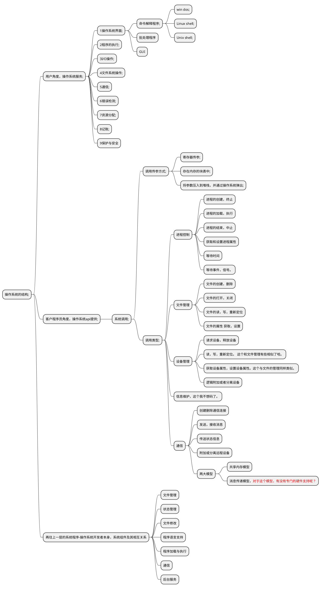
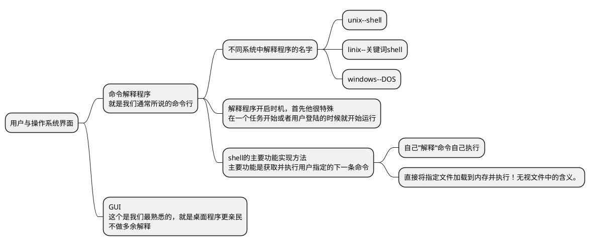

# 操作系统结构
在上一章的时候我们提到过，对于设计操作系统而言，系统目标的明确定义非常非常重要！在此重述来强调一下这个的重要性。因为有了这些目标，我们在实现的时候才能采取合理的策略和算法。这个决定了你的操作系统该如何设计。
操作系统三个维度的基本要求：
- 对用户而言，要注重系统提供的服务
- 对程序员而言，要关注用户和程序员采用的接口
- 对操作系统设计人员而言，需要明确系统组件及其相互关系。

## 2.1操作系统服务
很多的其实，直接上图。大部分功能其实很好理解的

## 用户与操作系统的界面
首先明确下，操作系统的界面相关，不属于操作系统内核的内容。这个家伙只不过是衍生出来的相关服务而已。

命令行与GUI比较
命令行更适合高手操作，并且由于其具有可编程功能，所以更适合执行一些想重复性的步骤
GUI嘛就是上手很快。更加面向普通用户。

## 操作系统的结构
### 简单结构
简单结构是操作系统最开始的结构，最初的dos就是简单结构，简单到哪种地步呢？就是任何模块的程序都能访问硬件这种程度。

ROM BIOS设备驱动-> MS_DOS设备驱动-> 常驻系统程序-> 应用程序，
从图中可以看出弊端，就是任何模块都能访问底层，是很不安全的，但是为什么这么写呢？原因是这个时期的内存少得可怜，发展初期呢。

### 分层结构
操作系统分为若干层，最底层为硬件层，最高层为用户接口，要求每层只能调用更底层的接口和服务，不能反着来。用以简化调试和验证的过程。

### 微内核

微内核是伴随着系统不断变大而来的。微内核是一种技术，其各个模块之间的通信靠的是消息传递。这样做的好处是一个模块除了问题，其他模块不会为此受到影响。

### 模块
这里的模块指的是可加载的内核模块。内核提供的是核心服务，但是其他服务可以在内核运行时动态实现。这些吧都不是很重要。我就粗略的看了一下，没有什么实质的东西

## 操作系统的调试
这个我个人是比较感兴趣的哈。所以我想记一下这里的知识点。
### 故障分析
有一种技术，是将内存里面的东西保存到硬盘的某一个地方。在某个时机（内核故障重启后或者其他时机，就会触发这种机制！）那么具体是，将这个信息存储到一个学名叫“崩溃转储文件的地方”。
而程序嘛，或多或少会发生崩溃的！当然我们的操作系统对于崩溃也是会有记录的，他会将一些发生的问题捕获出来，存放在一个文件以便于程序员进行分析。这是操作系统的基础能力之一。联想在开发的过程中我们通过bugReport进行一些jni上的崩溃分析，这就是操作系统干的活！其中用到的技术就是上个自然段里提到的那个。很有用哈
### 性能优化
代码的调试不仅仅只是解决一个崩溃啊，故障啊就完了。性能也是很重要的一部分。这也是很多高级程序员所追求的一种技能-性能优化。操作系统当然也会天然的提供一些方式好让开发人员做这方面的工作。
对于性能调试方面，主要集中于几大方案。虽然操作系统有很多，但是大致上也是差不多的！
- 跟踪列表，把所有相关的事件以及一些重要参数，都记录在一个文件里面，并提供专门的分析程序用以处理这些日志文件，以确定系统性能并识别瓶颈和低效处。
- 采用专用的交互工具。以便于用户和管理员检查各种系统组件的状态，从而可以寻找瓶颈。UNIX表现在top，这个我不清楚，WIN表现在任务管理器，这个其实大家还是稍微熟悉一些的。

#### DTrace工具
这个是作者着重提起到的一个性能调试工具。虽然不是很熟，但是还是看看吧，兴许以后用得到呢？
我开始还以为DTrace是debug呢，因为都带个D，仔细看了下文章，才发现我out啦。我觉得debug挺好的了，可是在作者这里这个已经是落后的了。那么Dtrace完虐的有哪些传统调试方式呢？我们顺便总结一下传统的调试方法
- CPU断点调试。这个很熟悉哈。这个是在硬件上就给与支持的。属于“天然的，本能的，基础的，设计之初就考虑到的。” 缺点是它不适合调试多用户的操作系统内核
- profiling， 这个在android开发中，我们有时候会看内存泄漏，其中用到的一个工具，就是profiler。我自己就用过。原理就是，周期采样指针指令，在特定的情况下生成特定的数据。缺点是减慢内核的运行。回忆一下我们以前用户的时候程序运行的场景，的确卡的要死！
