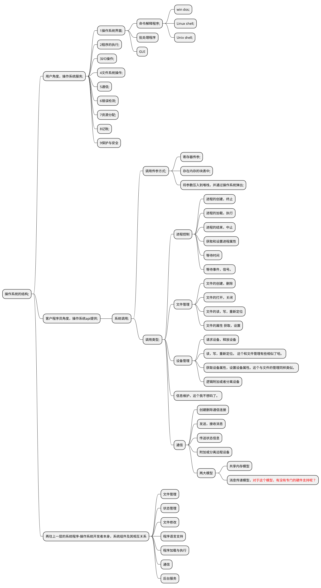
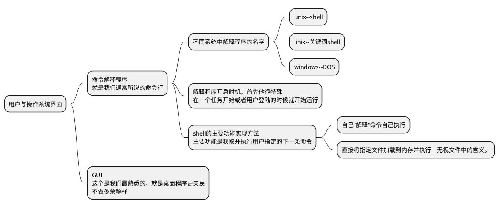

# 操作系统结构
在上一章的时候我们提到过，对于设计操作系统而言，系统目标的明确定义非常非常重要！在此重述来强调一下这个的重要性。因为有了这些目标，我们在实现的时候才能采取合理的策略和算法。这个决定了你的操作系统该如何设计。
操作系统三个维度的基本要求：
- 对用户而言，要注重系统提供的服务
- 对程序员而言，要关注用户和程序员采用的接口
- 对操作系统设计人员而言，需要明确系统组件及其相互关系。

## 2.1操作系统服务
很多的其实，直接上图。大部分功能其实很好理解的

## 用户与操作系统的界面
首先明确下，操作系统的界面相关，不属于操作系统内核的内容。这个家伙只不过是衍生出来的相关服务而已。

命令行与GUI比较
命令行更适合高手操作，并且由于其具有可编程功能，所以更适合执行一些想重复性的步骤
GUI嘛就是上手很快。更加面向普通用户。

## 操作系统的结构
### 简单结构
简单结构是操作系统最开始的结构，最初的dos就是简单结构，简单到哪种地步呢？就是任何模块的程序都能访问硬件这种程度。

ROM BIOS设备驱动-> MS_DOS设备驱动-> 常驻系统程序-> 应用程序，
从图中可以看出弊端，就是任何模块都能访问底层，是很不安全的，但是为什么这么写呢？原因是这个时期的内存少得可怜，发展初期呢。

### 分层结构
操作系统分为若干层，最底层为硬件层，最高层为用户接口，要求每层只能调用更底层的接口和服务，不能反着来。用以简化调试和验证的过程。

### 微内核

微内核是伴随着系统不断变大而来的。微内核是一种技术，其各个模块之间的通信靠的是消息传递。这样做的好处是一个模块除了问题，其他模块不会为此受到影响。

### 模块

这里的模块指的是可加载的内核模块。内核提供的是核心服务，但是其他服务可以在内核运行时动态实现。
