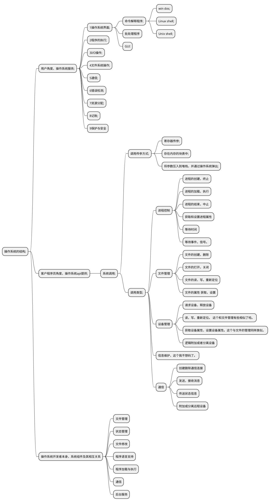

# 操作系统结构
在上一章的时候我们提到过，对于设计操作系统而言，系统目标的明确定义非常非常重要！在此重述来强调一下这个的重要性。因为有了这些目标，我们在实现的时候才能采取合理的策略和算法。这个决定了你的操作系统该如何设计。
操作系统三个维度的基本要求：
- 对用户而言，要注重系统提供的服务
- 对程序员而言，要关注用户和程序员采用的接口
- 对操作系统设计人员而言，需要明确系统组件及其相互关系。

## 2.1操作系统服务
很多的其实，直接上图。大部分功能其实很好理解的

## 用户与操作系统的界面
首先明确下，操作系统的界面相关，不属于操作系统内核的内容。这个家伙只不过是衍生出来的相关服务而已。

命令行与GUI比较
命令行更适合高手操作，并且由于其具有可编程功能，所以更适合执行一些想重复性的步骤
GUI嘛就是上手很快。更加面向普通用户。

## 2.3 系统调用
程序员写的一个很简单的程序，就会引发出非常多的系统调用。比如拷贝文件这一个操作哦，就会涉及到很多的系统调用，牵扯到很多的服务部分。例如找不到文件的界面返回，弹窗，复制粘贴涉及到的鼠标，GUI等等一系列的。并不是程序员调用API这么简单。里面涉及到的门道特别多。
而且系统调用实际上有多频繁呢？--一秒钟成千上万次！

操作系统由哪些语言实现的呢？ C， C++, 需要直接访问级硬件的则会用汇编来实现。

向操作系统传递参数有三种常用方法
- 寄存器传参
- 有时候参数的数量比寄存器要多，参数会存在内存的块中或者表中，块或者表的地址通过寄存器来传递。
- 压入到堆栈中，并通过操作系统弹出。有的系统比较偏爱这种方式。