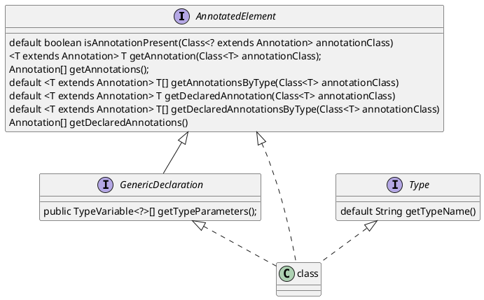

# Class类类图梳理

```puml
@startuml
interface AnnotatedElement{
    default boolean isAnnotationPresent(Class<? extends Annotation> annotationClass)
    <T extends Annotation> T getAnnotation(Class<T> annotationClass);
    Annotation[] getAnnotations();
    default <T extends Annotation> T[] getAnnotationsByType(Class<T> annotationClass)
    default <T extends Annotation> T getDeclaredAnnotation(Class<T> annotationClass)
    default <T extends Annotation> T[] getDeclaredAnnotationsByType(Class<T> annotationClass)
    Annotation[] getDeclaredAnnotations()
}

interface GenericDeclaration{
    public TypeVariable<?>[] getTypeParameters();
}

interface Type{
    default String getTypeName()
}

class class{}

GenericDeclaration -up-|> AnnotatedElement


class .up.|> GenericDeclaration
class .up.|> Type
' 问题来了，假如class不写实现AnnotatedElement， 那么它属于AnnotatedElement吗？
class .up.|> AnnotatedElement 
@enduml
```