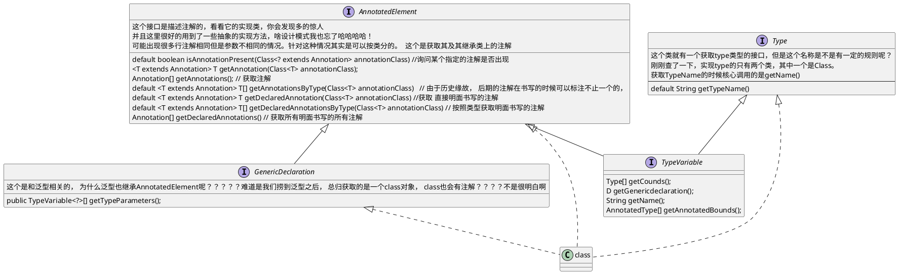

# Class类类图梳理

对于java这种语言上讲， 我们假设从来没有学过反射之类的知识点，只是把我们所用到的类，变量， 方法做分析的话，也能分析出以下的一些大致方面

类
- 从抽象程度上讲， 是接口，还是抽象类， 还是普通的类
- 从抽象程度的其他维度来讲，这个类上有无泛型
- 从作用域讲， 是共有的，保护的，还是私有的
- 从产生产生时机讲， 是静态的， 还是非静态的
- 从继承上讲， 它的父类有什么，实现的接口有什么， 它的子类有什么。
- 从实现上来讲， 它有什么变量， 方法
- 从注解上来讲，它上面还有什么注解， （注解实际上也是一个比较庞大的学习点， 我目前就会用它来进行一些简单的功能而已，这块我觉的是很好的点，是我们需要学习和掌握的）
  
变量

- 从变量作用域讲， 它的某个变量是私有的，共有的，还是受保护的，默认的
- 从产生时期讲， 它是静态的，还是非静态的
- 从类型上讲， 它是基础类型， 还是包装类， 还是一个稍微复杂的类

方法
- 从作用域讲， 它是私有的，共有的，受保护的，还是默认的
- 从产生时期上讲， 它是静态的还是非静态的
- 从实现上讲， 它的接收变量是啥，会吐出啥。
- 从抽象程度的其他维度来讲，这个方法上有无泛型

由此可见，实际上对于类型而言，有很多需要学习的点，以及我们如果了解透彻这套机制，肯定会有很多益处的！

下面我们先从类开始讲， 然后变量， 方法再跟上

# 类

## 我们以上面的一些维度，看看API相关的

|期望功能|方法|
| ---- | ---- |
|从抽象程度上讲， 是接口, 还是普通的类| isInterFace() 这个在Android这里是一个flag维护的|
|从抽象程度上讲， 是抽象类吗|判断是不是抽象类，目前没有找到好办法|
|从抽象程度的其他维度来讲，这个类上有无泛型|public TypeVariable<Class<T>>[] getTypeParameters() TypeVariable 继承自type， 这个是获取声明时的泛型，如果你声明的是个 E 那么获取的也是个E吧， 这个我得查验一下  Type[] getActualTypeArguments(); 获得运行期的泛型类型， 这个方法在ParameterizedType接口里面， 有的通过getGenericSuperclass 获得的结果，有的就是实现了ParameterizedType的|
|从继承上讲， 它的父类有什么，实现的接口有什么， 它的子类有什么。|getSuperClass（）可以返回直接父类，但是由于编译泛型擦除， 没有显示泛型参数 getGenericSuperclass() 返回直接继承的父类并包含泛型 |
|从作用域讲， 是共有的，保护的，还是私有的| 首先我们先确认一个问题，在运行时的时候，共有私有这个概念还重要么？？我认为作用域是用来限制程序员书写用的，我觉得没有这个概念也是可以的 | 
|从产生产生时机讲， 是静态的， 还是非静态的| 这个似乎也不重要|
|从实现上来讲， 它有什么变量， 方法|getMethods() 获取所有共有的方法， 包括从父类或者接口中继承来的  getDeclaredMethods()  获取所有方法，， 包括共有 私有 保护等等， 但是不包括从父类那里继承的！  getField()  getDeclaredFile 这些都是有异曲同工之处的|
|从注解上来讲，它上面还有什么注解| getAnnotationByType() 等等这个里面有很多的同时也有很多其他的方法，之后总结 | 
  
变量， 最终重点，会set就行
|期望功能|方法|
| ---- | ---- |
|从变量作用域讲， 它的某个变量是私有的，共有的，还是受保护的，默认的||
|从产生时期讲， 它是静态的，还是非静态的||
|从类型上讲， 它是基础类型， 还是包装类， 还是一个稍微复杂的类||

方法， 最终重点， 会invoke就行

|期望功能|方法|
| ---- | ---- |
|从作用域讲， 它是私有的，共有的，受保护的，还是默认的||
|从产生时期上讲， 它是静态的还是非静态的||
|从实现上讲， 它的接收变量是啥，会吐出啥。||
|从抽象程度的其他维度来讲，这个方法上有无泛型||

#### getXXXX 与 getDeclaredXXX区别
getMethods() 获取所有共有的方法， 包括从父类或者接口中继承来的
getDeclaredMethods()  获取所有方法，， 包括共有 私有 保护等等， 但是不包括从父类那里继承的！

凡是Declared 均不包含继承来的， 但是所有作用域的都会给到
凡是 不加的，只会给公共方法， 包括继承中拿来的方法。

## 