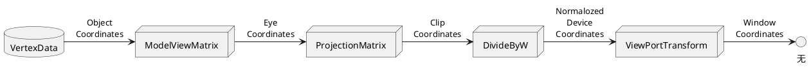

# opengl 相关坐标系

之所以谈坐标系，主要是我们看opengl代码的时候，很多涉及到matrix矩阵变化。


- 世界坐标系
- 对象，模型，局部。绘图坐标系
- 眼，相机坐标系
- 裁剪坐标系
- 归一化设备坐标系
- 屏幕坐标系

看到这些坐标系的时候，期初我自己也是有点懵的，好吧，我经常因为各种各样的问题懵。我觉得电脑写笔记的感觉挺舒适的。学了东西总要留下点什么，况且我不是那种追求速度的人。只是我的手指恐怕是有点承受不了了。现在个人心理状态也不是很好，整体的状态都不算很好吧。但心理觉得还是应该进步一下的，这么长时间一直原地踏步，我自己也有危机感了。慢慢积累起来吧。

想想为什么会有这么多乱七八糟的坐标系呢，其实这些坐标系一点也不乱七八糟，只是对于耐心不够还是初学的自己，一上来看这么眼花缭乱的东西，未免反感。在学习的时候加上自己的有感感觉也还不错。我似乎有太多压抑的事情不能排解。学习的时候顺便带些吐槽，能缓解一下，又能学习，或许是走出抑郁的良药呢？。。反正自己的笔记只有自己看。

opengl有个强大的功能是绘制3D，据我所知，导入模型，然后最终进行展示，这些都能干。
当一个三维的模型出现的时候，它有它自己的坐标，表面的每一个点都有自己的坐标，定一个原点，然后每一个点的坐标都是相对于原点，就能描述出这个物体。我们用opengl干的是啥呢？？是将一个3D的模型展示在2D的屏幕上的。是将一群3D模型展示二维的屏幕上的。 首先你不想其他的，势必也会想到必有3维到2维转换这种步骤，否则没办法展示啊。
假设随便给你两个物体，比如小球，一个直径一厘米，一个直径10厘米。你怎么让它最终以最自然的效果展示在屏幕上呢？

首先根据物体的原点，和其所有表面的点，搞清楚这么个模型是什么东西。
然后确定这两个球长什么样之后，他俩的位置得搞清吧， 万一人家重叠了位置，是不是还意味着要重新计算一次对不对？那么怎么搞清两者的位置？ 我们在这里才引出了上述第一个坐标系--世界坐标系。就像知道绝对位置那样，世界坐标系出现，就是为了让所有物体的标准全部统一，全部都换算成世界坐标系的数值。
接下来是干嘛呢？？所有小球的相对位置都换算成世界坐标系了，但我们最终是要展示在屏幕上的，但是不能瞎展示啊，要展示的自然，那么自然会出现一个观察者的位置，观察者在某个角度看这些小球。不同的角度，能够看到的表面顶点都是不一样的。例如一个观察者围着小球转一圈，每一个位置都不一样，你在屏幕上展示的究竟是从什么角度来看的呢？这点必须要搞清楚的。这里面就扯到了第三种坐标系--相机坐标系，引入这些来解决观察者观察之后涉及到的矩阵该如何变换。然后你换算完了，最终是要将你的三维的点砍掉一维直接展示要屏幕上的，其中涉及到其余的变换，然后展示的时候，各个点必须要遵循硬件屏幕的坐标，才能正确的展示。
好， 接下来我按照上述描述中涉及到的坐标系顺序，抄一下网上的帖子，看看这种是啥。

## 模型坐标系
模型坐标系是我们在进行三维建模的时候所使用的坐标系，例如3D max建模时采用的坐标系，我靠我都没用过3Dmax， 医学图像扫描时采用的坐标系，该坐标的原点一般选择的是当前物体的某个点，长度单位一般是实际的物理单位，如mm。这一坐标系一般在制作游戏模型时， 由建模软件给出，这也成为局部坐标系。
## 世界坐标系
我们在绘制三维图像的时候，一般会有很多几何体，如果采取上述的集合坐标系来进行绘制，则不同的物体有各自的模型坐标系。而openGl是要在一个场景下绘制所有几何体的。所以需要引入一个新的坐标系来描述所有的几何点坐标。为此，OpenGl就定义了世界坐标系。在绘制将要绘制的几何体之前。首先要将几何体的坐标从模型坐标转换到世界坐标系下。世界坐标系的定义是这样的：**以窗口的中心为原点，水平向右为X轴，垂直向上为Y轴，垂直屏幕指向屏幕外为Z轴， 长度按照如下定义：视口范围按此单位恰好是（-1， -1）左下角，到（+1， +1）右上角。** 世界坐标系和模型坐标系之间的关系如下：


加上一个知识点是：在世界坐标系中进行旋转操作时，需要指定的旋转角度，其方向是由右手法则来决定的。即右手握拳，大拇指指向某个坐标的正方向，那么其余四指指向的方向即为该坐标轴上的旋转角度的正方向。即旋转角增加的方向。在下图中用圆弧箭头进行标出：


## 相机坐标系
"横看成岭侧成峰，远近高低各不同"，这是中学时耳熟能详的句子，这是使人处于比较严重的山峰形态，其中横看，测看说的就是不同的相机坐标下山峰对象的成像效果，远近高低各不同讲的就是透视投影的效果，下面讲讲横看成岭侧成峰这种神奇的相机坐标系吧。
相机坐标系也称为人眼坐标系，视点坐标系。OpenGl的成像原理与照相机拍照，人眼看世界的原理类似，想想我们在看风景的时候，是不是也是一直调整眼睛的位置，一道道更好的观景效果？其实在调整的过程中，我们在一直改变人眼的坐标系。同样的在摄影时，我们也会选取一个较好的角度进行拍摄，在拍照片的时候我们也常常会摆出一个比较好看的pose，等等，都是一样的。OpenGl渲染本质上也是在拍照，所以同样要定义相机坐标系，这样才能定义遮挡关系，才能描述观察者离被观察物体的远近，才能确定物体前后的遮挡关系，所以相机坐标系在三维绘制中是非常重要的。相机的坐标系如下：


相机坐标系一般以相机所在的位置为原点，视线方向为Z轴方向，另外还要给出一个向上的方向，这样才可以确定相机的坐标系了，熟悉OpenGl API的同学都知道，定义视图变换矩阵的命令如下：
```
gluLookAt(GLdouble eyex, GLdouble eyey, GLdouble eyez,
Gldouble centerx, Gldouble centery, Gldouble centerz,
Gldouble upx, Gldouble upy, Gldouble upz);
```

该接口定义了共需要输入9个分量，前三个是人所在的位置，即人眼坐标系原点坐标的位置。中间三个分量指的是观察点的坐标，由此可以确定Z轴向量，最后三个分量指定Y轴向量，最后根据右手法则确定出X轴的向量，这样就可以构成世界坐标系到像极坐标系的变换矩阵了。当然，采用着色器编程之后，可以直接将**变换矩阵提交到着色器，由着色器完成顶点变换即可。**
为什么要这样做呢？
我觉得是为了让我们构建完，只切换相机镜头的视角就行了，并且其视角的参数也比较符合我们自己的认知习惯，最后涉及到的角度更易掌握。

## 屏幕坐标系
OpenGl渲染出来的图像最终以像素的形式展示在显示器中，就要在图形显示器上定义一个坐标系，这一坐标系称为屏幕坐标系，或视口坐标系。在OpenGl中，视口坐标系的原点位于视口的左下角，X轴和Y轴分别为水平向右和垂直向上，单位为像素。


从上图可以看出，视口其实是应用窗口中的一块区域，默认情况下，视口区域和莹莹程序窗口大小一致，我可能也可以使用一个OpenGl命令来改变视口的区域,其函数签名为：
```
void glViewport(GLint x, GLint y, GLint width, Glint height);
x       视口左下角x坐标
y       视口左下角y坐标
width   视口区域宽度
height  视口区域高度
```

## 坐标变换矩阵栈：
用来存储一系列的变换矩阵，栈顶就是当前的变换矩阵，进入opengl管道的每个坐标(其次坐标)都会先乘上这个矩阵，结果才是对应点在场景中的世界坐标。OpenGl中的坐标变换都是通过矩阵运算完成的。


对象坐标系（乘以模型视图矩阵）--> 眼睛坐标系（乘以投影矩阵）--> 裁剪坐标系（除以W）--> 标准设备坐标系（视口变换）--> 设备坐标系
