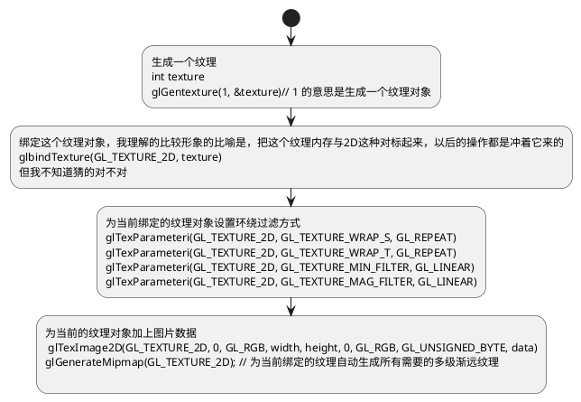

# 纹理
- glTexParameteri  设置纹理相关参数，这个是一个统一欧诺个方法，并且设置的是int类型
- glTexParameterfv 设置纹理相关参数，设置的是float类型的 
```
glTexParameterfv(GL_TEXTURE_2D, GL_TEXTURE_BORDER_COLOR, borderColor); 这个是设置float类型参数的方法
```
- glGenerateMipmaps 关于多级渐远纹理，颜色取值策略。
- glGenTextures 产生一个纹理  回想一下，我们生成顶点着色器的时候，和片段着色器的时候用的是啥来着？这个今天务必仔细的看下来龙去脉。豁出去了！
- glTexImage2D
## 涉及函数总结

## 正文
我们已经了解到，我们可以为每个顶点添加颜色来增加图形的细节，从而创建出有趣的图像。但是，如果想让图形看起来更加真实，我们就必须有足够多的顶点，从而指定足够多的颜色。这将会产生很多额外的开销，因为每个模型都会需求更多的顶点，每个顶点有需要一个颜色属性。
艺术家和程序员更喜欢用纹理(Texture)。 纹理是一个2D图片(甚至也有1D和3D的纹理)， 他可以用来添加物体的细节，你可以想象纹理是一张绘有砖块的纸，无缝折叠贴合到你的3D的房子上， 这样你的房子看起来就像有砖墙外表了。因为我们可以在一张图片上插入非常多的细节，这样就可以让物体非常精细而不用指定额外的顶点。
除了图像之外，纹理也看见恶意用来存储大量的数据，这些数据可以发送到着色器上，但这不是我们现在的主题。

下面你会看到之前教程的那个三角新办公贴上了一张砖墙图片。


为了能够让纹理映射到三角形上，我们需要指定三角形的每个顶点各自对应纹理的哪个部分。这样每个顶点就会关联着一个纹理坐标，用来表明该行纹理图像的哪个部分采样。之后在图形的其他片段上进行片段差值。
纹理坐标在x轴和y轴上，范围是0到1之间，注意我们使用的是2D纹理图像。使用纹理坐标获取纹理颜色叫做采样。纹理坐标起始与00， 也就是纹理的左下角终止于11， 与opengl的坐标系是不一样的注意一下哈！下面的图片展示了我们是如何把纹理坐标映射到三角形上的。

我们为三角形指定了三个纹理坐标点，如上图所示，我们希望三角形的左下角对应纹理的左下角，因此我们把三角形左下角顶点的纹理坐标设置为00，三角形的上顶点对应于图片的中上位置所以我们把他的纹理坐标设置为0.5， 1么同理右下方的定点位置为1,0， 我们只要给顶点着色器传递这三个纹理值就可以了，接下来他们会被传到片段着色器中，他会为每个片段进行纹理坐标的差值。

纹理坐标看起来就像这样：我靠这是逆时针画的！
```c++
float textCoord[] = {
    0.0f, 0.0f,
    1.0f, 0.0f,
    0.5f, 1.0f
};
```

我找找顶点着色器到底喂的什么数据，来证实一下自己猜的规律哈！

```c++
 float vertices[] {
    -0.5f, -0.5f, 0.0f,
    0.5f, -0.5f, 0.0f,
    0.0f, 0.5f, 0.0f
 }
```


看吧果然最开始的三角形也是逆时针画的，这样就对上了！！！

## 纹理环绕方式
纹理坐标的范围通常是0.0 到 1，1。 那如果我们把纹理的坐标设置在其范围之外会发生什么呢？？？OpenGl默认的行为是会重复这个纹理图像。我靠这几天我看的都是什么玩意儿啊！！！！还不如自己抄一遍！！！

|环绕方式|描述|
| :----: | :----: |
|GL_REPEAT|对纹理的默认行为，重复纹理图像|
|GL_MIRRORED_REPEAT| 和GL_REPEAT一样，但是每次重复图片是镜像放置的|
|GL_CLAMP_TO_EDGE|纹理的坐标会被约束在0到1之间，超出的部分会重复纹理坐标的边缘，产生一种边缘被拉伸的效果|
|GL_CLAMP_TO_BORDER|超出的坐标会为用户指定的边缘色|


前面提到的每个选项都可以使用getTexParameter函数对单独的一个坐标轴进行设置， s, t, r就相当于 x, y, z :

```c++
getTexParameteri(GL_TEXTURE_2D, GL_TEXTURE_WARP_S, GL_MIRRORED_REPEAT);
getTexParameteri(GL_TEXTURE_2D, GL_TEXTURE_WARP_T, GL_MIRRORED_REPEAT);
```
第一个参数指定了纹理目标， 我们使用的是2D纹理， 因此纹理目标是GL_TETURE_2D, 第二个参数需要我们指定设置的选项与纹理轴， 我们打算配置的是WRAP选项， 并且指定S和T轴， 最后一个参数是我需要我们传递的一个环绕方式。在这个例子中OpenGl会给当前激活的纹理设定纹理环绕方式为GL_MIRRORED_REPEAT;
如果我们选择GL_CLAMP_TO_BORDER选项的话，我们还需要指定一个边缘的颜色，这需要使用glTexParameter函数的 fv 后缀形式， 用GL_TETURE_BORDER_COLOR作为他的选项，并传递一个float数组作为边缘的颜色值。

```c++
float boprderColor[] = {1.0f,1.0f,1.0f,1.0f};
glTexParameterfv(GL_TEXTURE_2D, GL_TEXTURE_BORDER_COLOR, borderColor);
```

## 纹理过滤
纹理坐标不依赖于分辨率，他可以是任意的浮点值，所以OpenGl需要知道怎样将纹理的像素映射到纹理坐标。当你有一个很大的物体，但是纹理的分辨率变得很低的时候就变得很重要了。你可能已经猜到了，OpenGl也有对于纹理过滤的一个选项， 纹理过滤有很多选项， 但是我们只讨论最重要的两种： GL_NEAREST, 和 GL_LINEAR.

- GL_NEAREST 也叫邻近过滤， 是OpenGL默认的纹理过滤方式，当设置为GL_NEAREST的时候，OpenGl会选择中心点最接近纹理坐标的那个像素，下面图中你可以看到四个像素，加号代表纹理坐标，左上角那个纹理像素中心距离纹理最表最近，所以它会被选择为样本颜色。


- GL_LINEAR 也叫线性过滤，他会基于纹理坐标附近的纹理像素，计算出一个插值，近似出这些纹理像素之间的颜色。一个纹理像素的中心距离纹理坐标越近，那么这个纹理像素的颜色对最终的样本颜色的贡献就越大，下图你可以看到返回的颜色是紧邻像素的混合色：
  

那么这两种过滤方式会有怎样的额视觉效果呢？让我们看看在一个很大的物体上应用一张分辨率很低的纹理会发生什么吧(纹理被放大了， 每个纹理像素都能看到):

GL_NEAREST产生了颗粒状的图案， 我们能够清晰看到组成纹理的像素，而GL_LINEAR能够产生更加平滑的图案，很难看出单个的纹理像素，GL_LINEAR可以产生更加真实的输出，但是有些开发者更加喜欢8-bit风格，所以他们会用GL_NEAREST选项
当进行放大和缩小操作的时候可以设置纹理过滤的选项，比如你可以在纹理被缩小的时候使用临近过滤，在放大的时候使用现行过滤，我们需要使用glTexParameter函数为放大和缩小指定过滤方式。这段代码看起来会和纹理环绕方式的设置很相似：
```c++
glTxtparameteri(GL_TEXTURE_2D, GL_TEXTURE_MIN_FILTER, GL_NEAREST); 
glTexParameteri(GL_TEXTURE_2D, GL_TEXTURE_MAG_FILTER, GL_LINEAR);
```
PS: 看来 glTexParametri 函数， 是一个可以设置各种参数的参数。i 是 int的意思， 同时还有fv等等
GL_TEXTURE_MIN_FILTER 缩小过滤
GL_TEXTURE_MAG_FILTER 放大过滤

## 多级渐远纹理
想象一下，假设我们有一个包含着上千物体的大房间，每个物体上都有纹理。这些物体会很远，但是其纹理会拥有与进出物体同样高的分辨率。由于远处的物体可能只产生很少的片段，OpenGl从高分辨率纹理中为这些片段获取正确的颜色值就很困难。因为它需要对一个跨国纹理很大部分的片段只拾取一个纹理颜色，在小物体上这会产生不真实的感觉，更不用说他们使用高分辨率纹理浪费内存的问题了。
OpenGl使用一种叫做多级渐远纹理的概念来解决这个问题，他简单来说就是一系列的纹理图像，后一个纹理图像是前一个的二分之一。多级渐远纹理背后的理念很简单：距观察者的距离超过一定的阈值，OpenGl会使用不同的多级渐远纹理，即最适合物体距离的那个。由于距离远，解析度不高也不会被用户注意到。同时多级渐远纹理另一个加分之处就是他的性能非常好。让我们看看多级渐远纹理是什么样子的：


手工为每个纹理图像创建一系列多级渐远纹理是很麻烦的，我们可以一个函数全部指定。幸好OpenGL有一个glGenerateMipmap函数，在创建一个纹理后，调用它OpenGl就会承担接下来所有工作了，后面的教程你会看到该如何使用它。
在渲染中切换多级渐远纹理级别时，OpenGL在两个不同级别的多级纹理之间会产生不真实的生硬边界。就像普通纹理的纹理过滤一样，切换多级渐远纹理级别时你也可以在两个不同多级纹理级别之间使用 NEAREST 和 LINEAR 过滤。 为了指定不同多级渐远纹理级别之间的过滤方式，你可以使用以下四个选项中的一个代替原有的过滤方式。

|过滤方式|描述|
|:----:|:----:|
|GL_NEAREST_MIPMAP_NEAREST|使用最邻近的多级渐远纹理来匹配像素大小，并使用邻近插值来进行纹理采样|
|GL_LINEAR_MIPMAP_NEAREST|使用最邻近的多级渐远纹理级别，并使用现行插值进行采样|
|GL_NEAREEST_MIPMAP_LINEAR|在两个最匹配像素大小的多级渐远纹理之间进行线性插值，使用邻近插值进行采样|
|GL_LINEAR_MIPMAP_LINEAR| 在两个邻近的多级渐远纹理之间使用线性插值， 并使用线性插值进行采样|

```
glTexParameteri(GL_TEXTURE_2D, GL_TEXTURE_MIN_FILTER, GL_LINEAR_MIPMAP_LINEAR);
glTexParameteri(GL_TEXTURE_2D, GL_TEXTURE_MAG_FILTER, GL_LINEAR);
```
 // 设置方式和之前设置纹理插值方式一模一样，但是这个是和物体远近的处理有关
 一个常见的错误是，将放大过滤的选项设置为腹肌渐远纹理过滤的选项之一。这样是没有任何效果的、因为多级渐远纹理主要是使用在纹理被缩小的情况的：纹理放大不会使用多级渐远纹理；为放大过滤渐远选项会产生一个GL_INVALID_ENUM错误代码。

 # 加载与创建纹理
 在使用纹理之前要做的第一件事就是要把他们加载到我们的应用里。纹理图像可能被存储为各种各样的格式，美中都有自己的数据结构和排列，所以我们如何才能把这些图像加载到应用中呢？一个方案是选择一个需要的文件格式，比如.png， 然后自己写一个图像加载器，把图片转换为字节序列。写字机的图像加载器虽然不难，但是挺麻烦的，而且如果需要支持更多文件格式呢？你就不得不为美中你希望的格式写加载器了。
 另一种方案也许是更好的一种选择。使用一个支持多种格式的图像加载库来解决我们的问题，比如我们要用 std_image.h 库

 这个库啊，咱就不讲了，java也有很多好用的随便就代替了。这个库的目的就是将图片数据读出来 ，搞成咱们认识的对象，知道这里就行了。

 # 生成纹理
 和之前生成的OpenGl对象一样，纹理也是使用ID引用的。让我么来创建一个：
 ```c++
 unsigned int texture;
 glGenTextures(1, &texture); //注意方法名，是glGenTexture
 ```
 glGentextures函数首先需要输入生成纹理的数量，然后把他们存储在第二个参数的unsighed int 数组中，我们这里的例子只是一个单独的unsigned int， 就像其他对象一样我们需要绑定它， 但是绑定到底是把谁绑定到谁上？这块我是有些迷惑的。
 ```c++
 glBindtexture(GL_TEXTURE_2D, texture);
 ```
 <font color=red>难道这里只是为了说明，这个纹理是一个2D？</font>
 现在纹理已经绑定了，我们可以使用前面载入的图片数据去生成一个纹理了，纹理可以通过glTexImage2D来生成

 ```c++
 glTexImage2D(GL_TETURE_2D, 0, GL_RGB, width, height, 0, GL_RGB, GL_UNSIGNED_BYTE, data);
 glGenerateMipmap(GL_TEXTURE_2D);
 ```
 函数的参数很长，我们一个一个来解释：
 - GL_TETURE_2D 的那个，第一个参数指定了纹理目标，设置为 GL_TETURE_2D 意味着会生成与当前绑定的纹理对象在同一个目标上的纹理（任何绑定到 GL_TEXTURE_1D, 和 GL_TEXTURE_3D的纹理不会受影响）？？？ 其实我有些不明白，假设我有很多纹理呢？
 - 第二个参数为纹理指定多级渐远纹理的级别，如果你希望单独手动设置每个多级渐远纹理的级别的话，我们填0， 也就是基本级别。
 - 第三个参数，告诉OpenGl我们希望把纹理存储为何种格式。我们的图像只有RGB值，因此我们也把纹理存储为RGB值。
 - 第四个和第五个参数设置最终的纹理的宽度和高度。我们之前加载图像的时候已经存储了这些数值，所以我们使用了对应的变量。
 - 这个参数总是被设置为0，什么意义不用理会了，这是历史遗留问题。
 - 第七个和第八个参数，我们指定了元数据的图片格式和数据类型，我们使用RGB值来加载这个图像的，并把他们存储为char(byte)数组，我们将会传入对应值。
 - 最后一个非常简单，就是这个图片的数据。

<font color=red>刚才的ID跑哪去了？？？什么关联？？？？</font>
当我们调用 glTexImage2D 时，当前绑定的纹理对象(对就是我们刚刚调用绑定的那个函数)， 就那个生成的texture，会被附加上纹理图像。然而，目前只有基本级别(Base-level)的纹理图像被加载了，如果我们要使用多级渐远纹理，我们必须手动设置不同的图像，不断传递第二个参数。或者直接在生成纹理之后调用glGenerateMipmap 这会为当前绑定的纹理自动生成所有需要的多级渐远纹理。
生成了纹理和相应的多级渐远纹理之后，释放图像的内存是一个很好的习惯。。
```c++
stbi_image_free(data);
```
纹理如何对应顶点呢？现在我们只会把图片给搞到相应的纹理上， 但是纹理对象怎么跟物体的顶点对应呢？
生成一个纹理的流程看起来像是这样的



# 应用文理

后面这部分我们会使用 glDrawElements绘制，我们需要告知OpenGL如何采样纹理，所以我们必须使用纹理坐标更新顶点数据。
逆时针长方形

```c++
float vertices[] = {
//     ---- 位置 ----       ---- 颜色 ----     - 纹理坐标 -
     0.5f,  0.5f, 0.0f,   1.0f, 0.0f, 0.0f,   1.0f, 1.0f,   // 右上
     0.5f, -0.5f, 0.0f,   0.0f, 1.0f, 0.0f,   1.0f, 0.0f,   // 右下
    -0.5f, -0.5f, 0.0f,   0.0f, 0.0f, 1.0f,   0.0f, 0.0f,   // 左下
    -0.5f,  0.5f, 0.0f,   1.0f, 1.0f, 0.0f,   0.0f, 1.0f    // 左上
};
```
由于我们添加了一个额外的顶点属性，我们必须告诉OpenGL我们新的顶点格式：


```c++
glVertexAttribPonter(2, 2, GL_FLOAT, GL_FALSE, 8 * sizeof(float), (void*)(6*seizeof(flost))); // 参数一会儿解释
glEnableVertexAttriArray(2)
```

对于这两个函数的意思。我们需要往前翻文档。因为这俩函数依然是比较通用的函数，对于操作的是哪个对象，还是要看我们目前绑定了那些纹理。我们回到顶点着色器那里来看:


下面是一个顶点着色器的解析设置案例


我们使用glVertexAtrribPointer函数告诉如何解析顶点数据。应用到逐个顶点属性上。这个方法的名字就是我们上文中说的方法名字。里面有个关键字叫vertex说明和顶点有关，尽管我们当时设置的是一个纹理。
```c++
glVertexAtrribPomter(0, 3, GL_FLOAT, GL_FALSE, 3 * sizeof(float), (void*) 0);
glEnableVertexAttribArray(0)
```

**glVertexAttribPointer函数详解**
- 第一个参数指定我们要配置的顶点属性位置，我们顶点纹理的属性的位置很明显就是从0的位置开始的！所以我们传入0，要让解析的时候知道是从0开始的！
- 第二个参数指定的是，我们的顶点属性是几个值，也就是大小，我们很明显，是x, y, z三个值，所以给的是3， 同时，我们的着色器脚本中本来就是把这个定义为vec3 了，说明这就是一个三位解释一点的。没毛病，正好对应的！
- 第三个是指定的数据类型是什么， 因为我们给的就是浮点类型，所以就写浮点。这样着色器知道怎么解析
- 第四个是。是否希望数据被标准化。那么什么是标准化呢？ 就是所有的数据都会被映射到 0 到 1 之间，但是我们顶点的位置你晓得，，都给负数了，可不能变啊！所以给的是false
- 第五个是步长，他告诉我们在连续的顶点属性组之间的间隔！ 这个很重要的！因为我们以后可能不止在数组中键入顶点属性！ 还有其他的属性的！！这为我们做好了扩展，目前从图中可以看出，下一个顶点属性的位置离上一个顶点属性正好是3个格还都是float！所以我们给出的是 3 * sizeof(float).
- 最后一个参数类型是void* 所以我们进行这个奇怪的强制类型转换。他表示位置数据在缓冲中起始位置的偏移量！由于位置数据在数组的开头，我们这里给的是0.

我靠顶点数据去哪里了，，，，，，我回头看看他们这块是怎么搞的：
```c++
float vertices[] = {
    -0.5f, -0.5f, 0.0f,
     0.5f, -0.5f, 0.0f,
     0.0f,  0.5f, 0.0f
};

unsigned int VBO;
glGenBuffers(1, &VBO); //顶点缓冲对象
glBindBuffer(GL_ARRAY_BUFFER, VBO);  // 把新创建的缓冲绑定到GL_ARRAY_BUFFER目标上  这个跟纹理不同，是bindBuffer
// 重点来了，绑定之后喂数据了！以后所有的操作八成要是他了！

glBufferData(GL_ARRAY_BUFFER, sizeof(vertices), vertices, GL_STATIC_DRAW);   // 我靠，我们指定了GL_ARRAY_BUFFER！！！！
```
