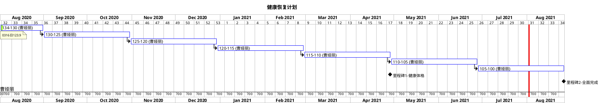
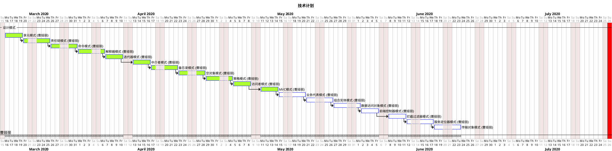
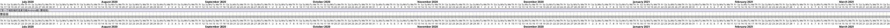

```puml
@startgantt
title 健康恢复计划 
printscale weekly
Project starts the 2020-08-02

<style>
ganttDiagram {
    task {
		BackGroundColor GreenYellow
		LineColor blue
	}
}
</style>
[134-130] on {曹娅丽} lasts 30 days and is 5% completed
note bottom
0316日123.9
end note

then [130-125] on {曹娅丽} lasts 60 days and is 0% completed
then [125-120] on {曹娅丽} lasts 60 days and is 0% completed
then [120-115] on {曹娅丽} lasts 60 days and is 0% completed
then [115-110] on {曹娅丽} lasts 60 days and is 0% completed
then [110-105] on {曹娅丽} lasts 60 days and is 0% completed
then [105-100] on {曹娅丽} lasts 60 days and is 0% completed

[里程碑1-健康体格] happens at [115-110]'s end
[里程碑2-全面完成] happens at [105-100]'s end

today is 2021-08-02 and is colored in red
@endgantt
```

```puml
@startgantt
title 技术计划
<style>
ganttDiagram {
    task {
		BackGroundColor GreenYellow
		LineColor blue
	}
}
</style>

printscale daily
project starts the 2020-03-15
saturday are closed
sunday are closed

--设计模式--
[享元模式] on {曹娅丽} lasts 4 days and is 100% completed
then [责任链模式] on {曹娅丽} lasts 4 days and is 100% completed
then [命令模式] on {曹娅丽} lasts 4 days and is 100% completed
then [解释器模式] on {曹娅丽} lasts 4 days and is 100% completed
then [迭代器模式] on {曹娅丽} lasts 4 days and is 100% completed
then [中介者模式] on {曹娅丽} lasts 4 days and is 100% completed
then [备忘录模式] on {曹娅丽} lasts 4 days and is 100% completed
then [空对象模式] on {曹娅丽} lasts 4 days and is 100% completed
then [策略模式] on {曹娅丽} lasts 4 days and is 100% completed
then [访问者模式] on {曹娅丽} lasts 4 days and is 100% completed
then [MVC模式] on {曹娅丽} lasts 4 days and is 100% completed
then [业务代表模式] on {曹娅丽} lasts 4 days and is 0% completed
then [组合实体模式] on {曹娅丽} lasts 4 days and is 0% completed
then [数据访问对象模式] on {曹娅丽} lasts 4 days and is 0% completed
then [前端控制器模式] on {曹娅丽} lasts 4 days and is 0% completed
then [拦截过滤器模式] on {曹娅丽} lasts 4 days and is 0% completed
then [服务定位器模式] on {曹娅丽} lasts 4 days and is 0% completed
then [传输对象模式] on {曹娅丽} lasts 4 days and is 0% completed

today is 2020-07-26 and is colored in red

@endgantt
```

```puml
@startgantt
Project starts the 2020/07/16
[写一个端到端的连麦功能Android版] on {曹娅丽} lasts 364 days
@endgantt
```