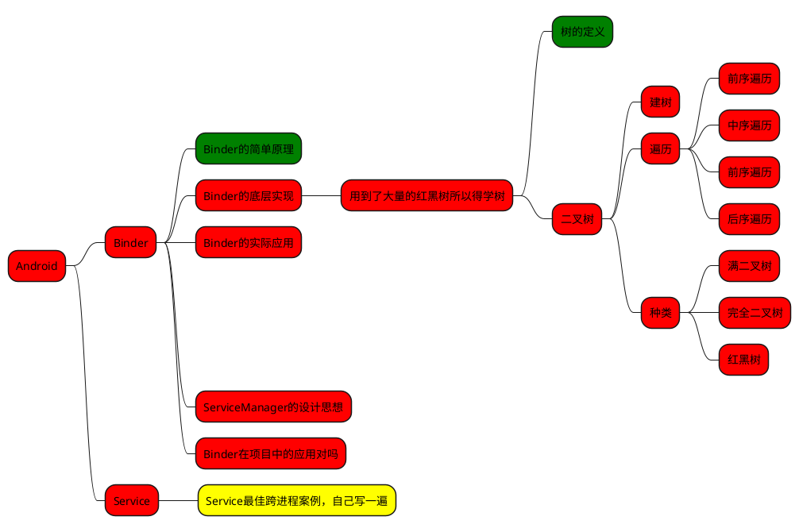
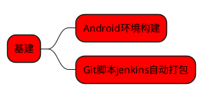

```puml
@startmindmap 
*[#red] Android
 *[#red] Binder
  *[#green] Binder的简单原理
  *[#red] Binder的底层实现
   *[#red] 用到了大量的红黑树所以得学树
    *[#green] 树的定义
    *[#red] 二叉树
     *[#red] 建树
     *[#red] 遍历
      *[#red] 前序遍历
      *[#red] 中序遍历
      *[#red] 前序遍历
      *[#red] 后序遍历
     *[#red] 种类
      *[#red] 满二叉树
      *[#red] 完全二叉树
      *[#red] 红黑树
  *[#red] Binder的实际应用
  *[#red] ServiceManager的设计思想
  *[#red] Binder在项目中的应用对吗
 *[#red] Service
  *[#yellow] Service最佳跨进程案例，自己写一遍
@endmindmap
```

```puml
@startmindmap 
*[#red] 基建
 *[#red] Android环境构建
 *[#red] Git脚本jenkins自动打包
@endmindmap
```

```puml
@startmindmap 
*[#red] Java编程思想
 *[#red] 反射
  *[#red] 获取一个真实类的method的所有注解，其父类此方法的注解，的最佳方案。为什么
@endmindmap
```