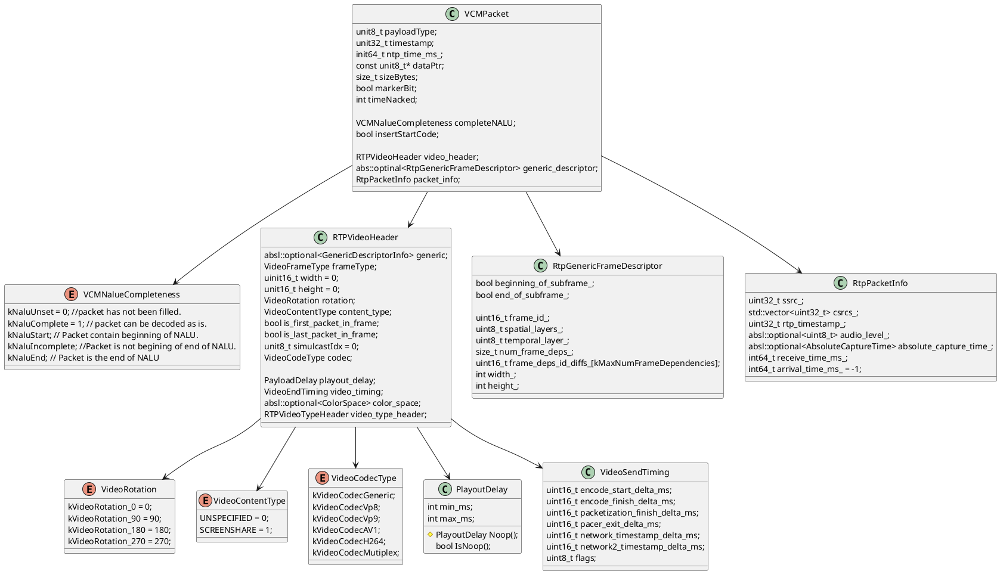

```puml
@startuml
class VCMPacket{
    unit8_t payloadType;
    unit32_t timestamp;
    init64_t ntp_time_ms_;
    const unit8_t* dataPtr;
    size_t sizeBytes;
    bool markerBit;
    int timeNacked;

    VCMNalueCompleteness completeNALU;
    bool insertStartCode;

    RTPVideoHeader video_header;
    abs::optinal<RtpGenericFrameDescriptor> generic_descriptor;
    RtpPacketInfo packet_info;
}

enum VCMNalueCompleteness{
    kNaluUnset = 0; //packet has not been filled.
    kNaluComplete = 1; // packet can be decoded as is.
    kNaluStart; // Packet contain beginning of NALU.
    kNaluIncomplete; //Packet is not begining of end of NALU.
    kNaluEnd; // Packet is the end of NALU
}

class RTPVideoHeader{
    absl::optional<GenericDescriptorInfo> generic;
    VideoFrameType frameType;
    uinit16_t width = 0;
    unit16_t height = 0;
    VideoRotation rotation;
    VideoContentType content_type;
    bool is_first_packet_in_frame;
    bool is_last_packet_in_frame;
    unit8_t simulcastIdx = 0;
    VideoCodeType codec;

    PayloadDelay playout_delay;
    VideoEndTiming video_timing;
    absl::optional<ColorSpace> color_space;
    RTPVideoTypeHeader video_type_header;
}

enum VideoRotation{
    kVideoRotation_0 = 0;
    kVideoRotation_90 = 90;
    kVideoRotation_180 = 180;
    kVideoRotation_270 = 270;
}

enum VideoContentType{
    UNSPECIFIED = 0;
    SCREENSHARE = 1;
}

enum VideoCodecType{
    kVideoCodecGeneric;
    kVideoCodecVp8;
    kVideoCodecVp9;
    kVideoCodecAV1;
    kVideoCodecH264;
    kVideoCodecMutiplex;
}

class PlayoutDelay{
    int min_ms;
    int max_ms;

    # PlayoutDelay Noop();
    bool IsNoop();
}

class VideoSendTiming{
    uint16_t encode_start_delta_ms;
  uint16_t encode_finish_delta_ms;
  uint16_t packetization_finish_delta_ms;
  uint16_t pacer_exit_delta_ms;
  uint16_t network_timestamp_delta_ms;
  uint16_t network2_timestamp_delta_ms;
  uint8_t flags;
}

RTPVideoHeader --> VideoRotation
RTPVideoHeader --> VideoContentType
RTPVideoHeader --> VideoCodecType
RTPVideoHeader --> PlayoutDelay
RTPVideoHeader --> VideoSendTiming

class RtpGenericFrameDescriptor{
    bool beginning_of_subframe_;
    bool end_of_subframe_;

    uint16_t frame_id_;
    uint8_t spatial_layers_;
    uint8_t temporal_layer_;
    size_t num_frame_deps_;
    uint16_t frame_deps_id_diffs_[kMaxNumFrameDependencies];
    int width_;
    int height_;
}

class RtpPacketInfo{
  uint32_t ssrc_;
  std::vector<uint32_t> csrcs_;
  uint32_t rtp_timestamp_;
  absl::optional<uint8_t> audio_level_;
  absl::optional<AbsoluteCaptureTime> absolute_capture_time_;
  int64_t receive_time_ms_;
  int64_t arrival_time_ms_ = -1;
}

VCMPacket--> VCMNalueCompleteness
VCMPacket--> RTPVideoHeader
VCMPacket--> RtpGenericFrameDescriptor
VCMPacket--> RtpPacketInfo
@enduml
```