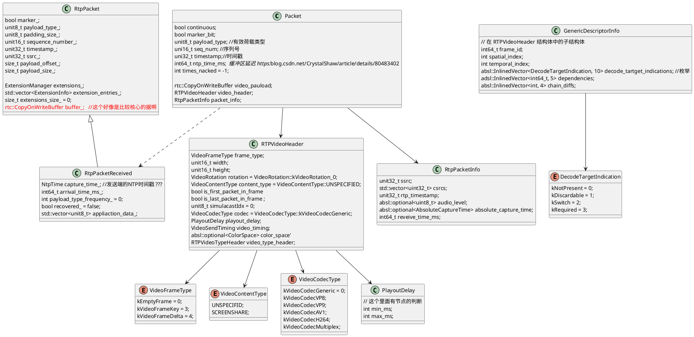

# 相关流程

## InsertPacket

首先判断是不是新的第一个包，判断条件是，first_packet_received_ 是不是true， 不是的话，就当它是第一个包，进行
```java
first_seq_num_ = seq_num;
first_packet_received_ = true;
```

如果已经有第一个新包
### Author：曹娅丽
### Description：
本类具体的工作在于组帧。发生时机为，收到远端视频数据之后，对RTC数据包进行组帧。

### Details：
#### 概念简介：

- **RTP：** 全名实时传输协议(Real-time Transport Protocol),由IETF的音视频传输工作组设计，其能力是为数据提供具有实时特征的端对端传送服务，例如在组播或者单播网络服务下的交互音视频或模拟数据，例如用来为IP网上的语音，图像，传真等多种需要实时传输的多媒体数据提供端到端的实时传输服务！其下有两个子协议， RTP和RTCP(控制协议)， 这两个协议会配合起来共同作用。比如RTP为Internet上端到端的实时传输提供时间信息和流同步，但并不会保证服务质量，服务质量是由RTCP来提供的。本文只是做下简介有个大致了解即可，如果对具体协议好奇，请见 [官方指导文档](https://datatracker.ietf.org/doc/html/rfc3551) ， 以及自行查阅资料！
- **组帧：** 视频一帧数据往往被拆分为多个packet进行发送，组帧是将接受到的packets重组为视频帧。组帧的关键在于找到视频帧的其实与终止packet。对于h264编码的视频帧，rtc传输时并没有明确的起始标志， webrtc在处理时以连续序列号的时间戳是否相同为依据，如果不相同则认为找到了视频帧的起始packet。视频帧的结束标识为 rtp包的header中的Mark标志位，对于vp8， vp9 则可以从rtp包中解析到明确的帧开始与结束标识符。组帧结束后，拿到完整的视频帧数据之后对该视频数据进行参考帧信息设置，随后送入framebuffer, 以便于从中取帧进行解码。


### Namespace：webrtc::video_coding

### Class Name：PacketBuffer

##### inherited Class：无

##### Static Member Var：无

##### Member Var：

```C++
bool continuous; //是否所有的包都被插入到buffer中
bool marker_bit; 
unit8_t payload_type; //有效荷载类型， 详情请见 https://www.rfc-editor.org/rfc/rfc3551
uni16_t seq_num; //序列号
uni32_t timestamp;//时间戳
int64_t ntp_time_ms; // 缓冲区延迟
int times_nacked = -1; 
rtc::CopyOnWriteBuffer video_payload;
RTPVideoHeader video_header;
RtpPacketInfo packet_info;
```

##### Member Func：

```C++
/// 插入一个包， 组帧操作
/// @param packet RTC视频数据包
/// @return InsertResult 如果插入当前的包之后，发现已经有一个完整的视频帧， 就会对 InsertResult packets 赋值。
PacketBuffer::InsertResult PacketBuffer::InsertPacket(
    std::unique_ptr<PacketBuffer::Packet> packet)
```

Func Body：无

Note：

------

```C++
/// 根据序列号更新丢包数据，并返回帧数据(如果是一个完整的帧)
/// @param seq_num 序列号
/// @return 
InsertResult InsertPadding(uint16_t seq_num) ABSL_MUST_USE_RESULT
      RTC_LOCKS_EXCLUDED(mutex_);
}
```

Func Body：无

Note：无

------


```C++
/// 更新丢包信息
/// @param seq_num 包的序列号
/// @return 
void PacketBuffer::UpdateMissingPackets(uint16_t seq_num)
```
Func Body：无


------


```C++
/// 根据新增的序列号，查找是否buffer内容是一个完整的帧数据
/// @param seq_num 包的序列号
/// @return 完整的帧数据
std::vector<std::unique_ptr<PacketBuffer::Packet>> PacketBuffer::FindFrames(
    uint16_t seq_num)
```

Func Body：无

Note：无

------


```C++
/// 预测当前的序列号是不是新的帧里面的包
/// @param seq_num 序列号
/// @return 是否是新的一帧里面的包
bool PacketBuffer::PotentialNewFrame(uint16_t seq_num)
```

Func Body：无
Note：

------

```C++
/// 清除从第一个序列号到索引位置的数据
/// @param seq_num 索引号
void PacketBuffer::ClearTo(uint16_t seq_num)
```

Func Body：无

Note：无

------

```C++
/// 清除所有数据
void PacketBuffer::Clear()
```


Func Body：无

Note：无

------

```C++
/// 返回最后一个包记录的毫秒时间戳
absl::optional<int64_t> PacketBuffer::LastReceivedPacketMs()
```

Func Body：无

Note：无

------

```C++
/// 返回最后一个关键帧包的毫秒时间戳(该时间戳为本地时间)
absl::optional<int64_t> PacketBuffer::LastReceivedKeyframePacketMs() 
```

Func Body：无

Note：无

### Note：


### Appendix：

------


