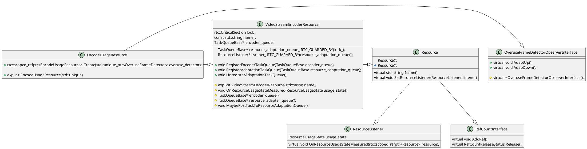

类图 encode_usage_resource.h

```puml
@startuml
class EncodeUsageResource{
    + {static} rtc::scoped_refptr<EncodeUsageResource> Create(std::unique_ptr<OveruseFrameDetector> overuse_detector);

    + explicit EncodeUsageResource(std::unique)
}

class VideoStreamEncoderResource {
    rtc::CriticalSection lock_;
    const std::string name_;
    TaskQueueBase* encoder_queue;
    TaskQueueBase* resource_adaptation_queue_ RTC_GUARDED_BY(lock_);
    ResourceListener* listener_ RTC_GUARAED_BY(resource_adaptation_queue());

    + void RegisterEncoderTaskQueue(TaskQueueBase encoder_queue);
    + void RegisterAdaptationTaskQueue(TaskQueueBase resource_adaptation_queue);
    + void UnregisterAdaptationTaskQueue();

    # explicit VideoStreamEncoderResource(std::string name);
    # void OnResourceUsageStateMeasured(ResourceUsageState usage_state);
    # TaskQueueBase* encoder_queue();
    # TaskQueueBase* resource_adapter_queue();
    # void MaybePostTaskToResourceAdaptationQueue();
}

class OveruseFrameDetectorObserverInterface{
    + virtual void AdaptUp();
    + virtual void AdapDown();

    # virtual ~OveruseFrameDetectorObserverInterface();
}

class Resource{
    Resource();
    ~Resource();
    ----
    virtual std::string Name();
    virtual void SetResourceListener(ResourceListener listener)
}

class ResourceListener{
    virtual void OnResourceUsageStateMeasured(rtc::scoped_refptr<Resource> resource),
    ResourceUsageState usage_state
}

class RefCountInterface{
    virtual void AddRef()
    virtual RefCountReleaseStatus Release();
}

EncodeUsageResource -|> OveruseFrameDetectorObserverInterface
EncodeUsageResource -|> VideoStreamEncoderResource

VideoStreamEncoderResource -|> Resource
Resource ..|> ResourceListener
Resource --|> RefCountInterface
@enduml
```