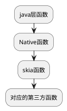

主讲图片
[Android中的图片压缩技术详解](https://blog.csdn.net/yangxu4536/article/details/107914518)
[原以为哈夫曼树、哈夫曼编码很难，结果大佬用6张图就讲明白了](https://baijiahao.baidu.com/s?id=1703246574212691625&wfr=spider&for=pc)
# 图片格式
为什么讲图片格式呢？因为我在网上看到有的就是改了图片格式就可以减小体积。有些好奇！所以，复习一下喽

# Skia 图像引擎
我们在压缩图片的时候会看到这样的代码


对于这样的代码，我们有必要引出一个skia图像引擎的概念。
skia图像引擎是Google自己维护的，C++实现的图像引擎，实现了各种图像处理功能，并且广泛的应用于谷歌和其他公司的产品中，比如： chrome, firFox, Android 等。基于他们可以很方便的为操作系统，浏览器等开发图像处理功能。
Skia在Android中提供了简单的画图和简单的编解码功能，但是其灵活的是，可以挂载其他的第三方编解码或者硬件编解码库，例如 libpng 和 libjpeg, libgif等。当我们调用函数```bitmap.compress(Bitmap.CompressFormat.JPEG...)```的时候，最终会调用的其实是libjpeg.so动态库进行编码压缩。
所以针对上面的代码，实际上，Android编码保存图片的逻辑是：

所以skia就像是一个胶水层，用来连接各种第三方的编解码库，不过Android也会对这些库做出一些修改，比如**修改内存管理方式**等等。
Android在之前也是从某种程度来说使用的算是libjpeg的功能阉割版，压缩图片默认使用的是standard huffman， 而不是optimized huffman，也就是说使用的是默认的哈夫曼表，并没有根据实际的图片内容去计算对应的哈夫曼表。Google在最开始的时候考虑到了手机的性能瓶颈，计算图片权重这个阶段是十分占用CPU资源的同时也非常耗时，因为此时需要计算图片所有像素的argb的权重，这也是Android的图片压缩率对比IOS差了一些的原因之一。

挑战一个比较难的知识点： 哈夫曼树

## 常见的图片格式及特点


- PNG
- JPG
- JPEG
- WEBP
- 